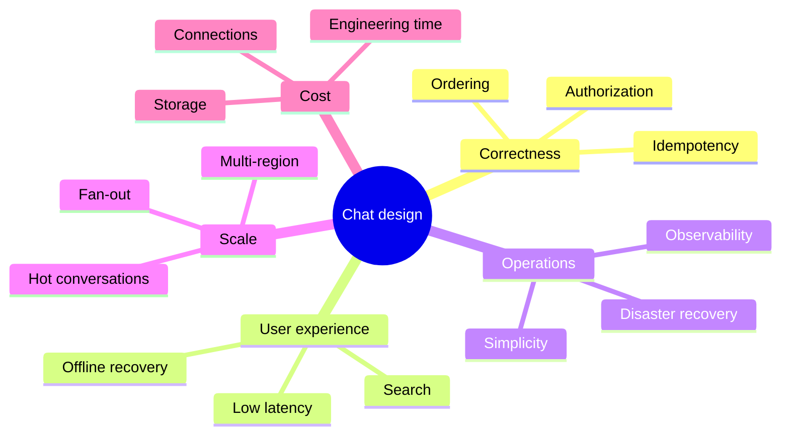
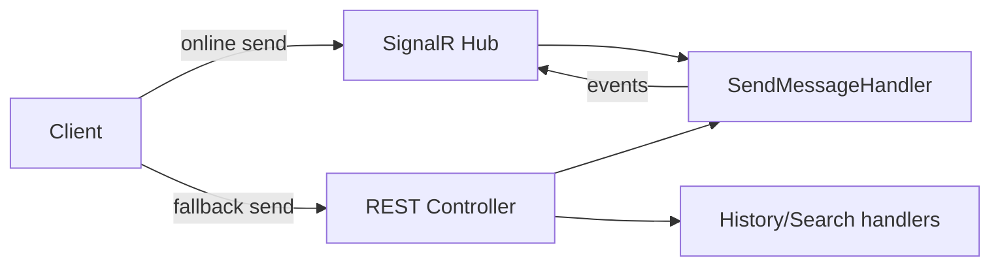
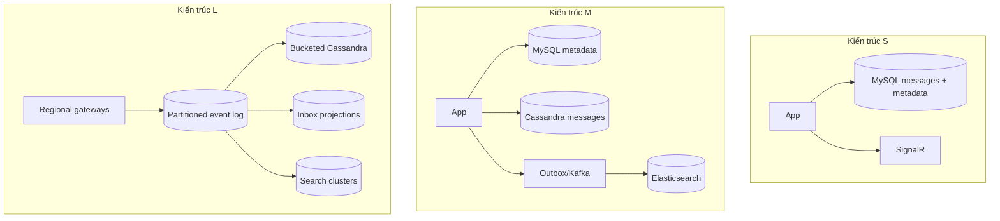
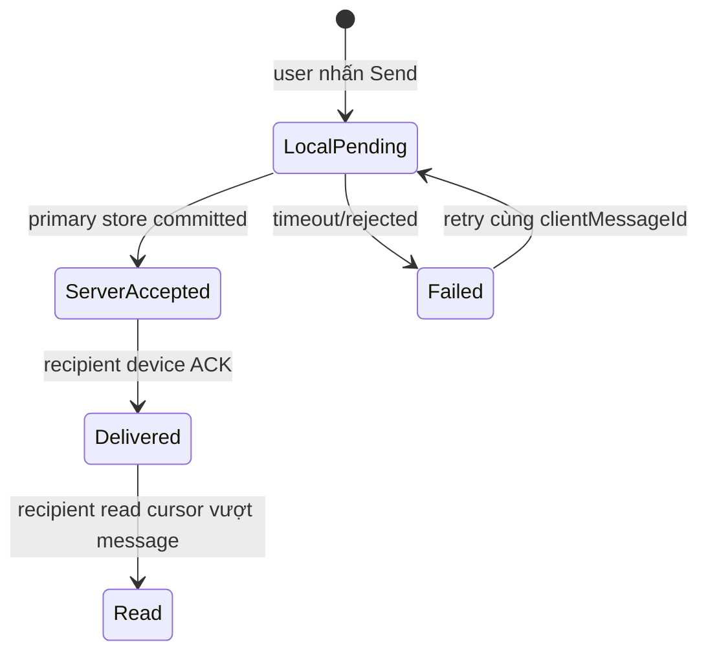
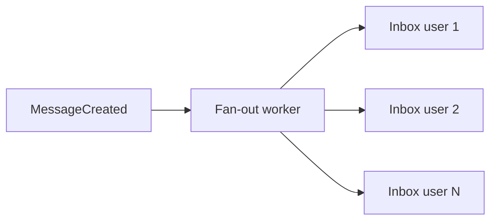
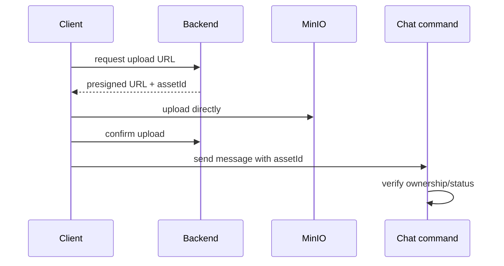
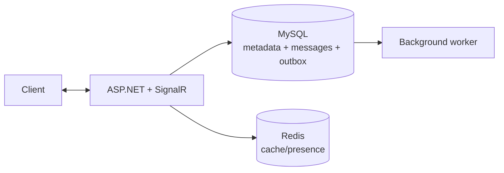
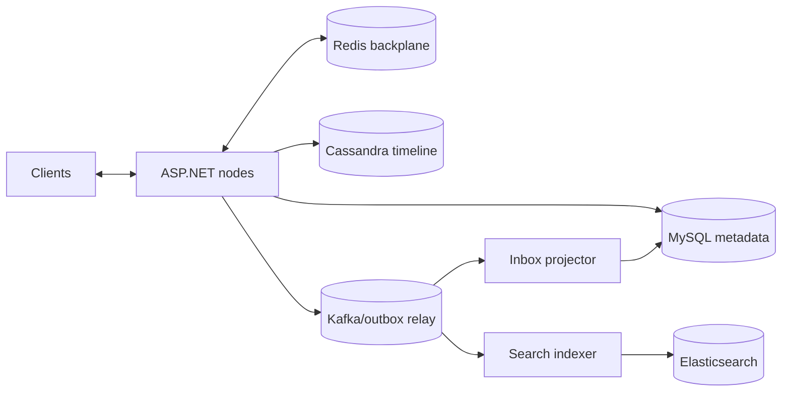
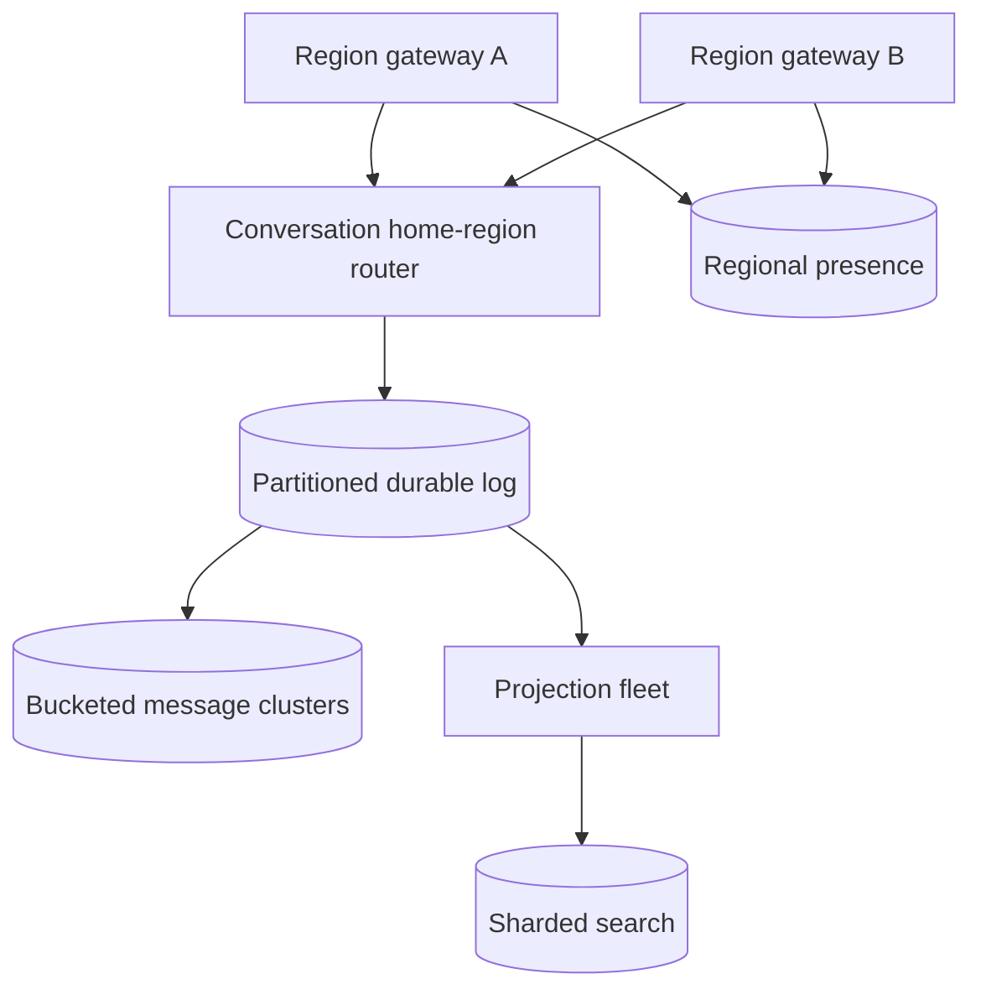

# Seminar II: Các phương pháp thiết kế và triển khai luồng Chat

> Companion document của `chat-system-design-seminar.md`  
> Mục tiêu: không tìm một “kiến trúc tốt nhất”, mà học cách chọn kiến trúc phù hợp với quy mô, SLA, đội ngũ và ngân sách.

## 1. Cách đọc tài liệu

Mỗi nhóm giải pháp được trình bày theo cùng format:

1. Bài toán cần giải quyết.
2. Các phương pháp có thể chọn.
3. Code hoặc data model minh họa.
4. Ưu điểm, nhược điểm và failure mode.
5. Phạm vi nên dùng.
6. Dấu hiệu cần nâng cấp sang phương án khác.

Ba mức quy mô được dùng xuyên suốt:

| Mức | Quy mô tham khảo | Mục tiêu chính |
|---|---:|---|
| S — nhỏ | dưới 10.000 DAU, traffic vừa | giao hàng nhanh, vận hành đơn giản |
| M — vừa | 10.000–1.000.000 DAU | scale ngang, fault isolation, observability |
| L — lớn | trên 1.000.000 DAU hoặc community cực nóng | partitioning, multi-region, cost efficiency |

Các con số chỉ là điểm bắt đầu. Một community 100.000 người hoạt động đồng thời có thể khó hơn một hệ thống một triệu user nhưng ít chat.

## 2. Không có kiến trúc chat “tốt nhất”

Thiết kế là bài toán tối ưu nhiều mục tiêu đối nghịch:



Một hệ thống đơn giản, đúng và quan sát được thường tốt hơn một hệ thống “giống Big Tech” nhưng đội ngũ không vận hành nổi.

## 3. Khung ra quyết định

Trước khi chọn công nghệ, trả lời:

- Message có được phép mất không?
- Có cần thứ tự tuyệt đối hay chỉ thứ tự hợp lý trên UI?
- User offline bao lâu vẫn phải nhận lại message?
- Direct, group và community có cùng SLA không?
- Một conversation nóng nhất có bao nhiêu message/giây?
- Search chậm vài giây có chấp nhận được không?
- Triển khai một region hay nhiều region?
- Đội ngũ có vận hành Cassandra, Kafka, Elasticsearch được không?

Nếu chưa có số liệu, chọn kiến trúc S, thêm telemetry và thiết kế abstraction để nâng cấp.

## 4. Phương pháp giao tiếp client–server

### 4.1 Short polling

Client gọi HTTP định kỳ:

```javascript
setInterval(async () => {
  const messages = await fetch(`/api/chat/messages?after=${cursor}`)
    .then(r => r.json());
  merge(messages);
}, 3000);
```

| Ưu điểm | Nhược điểm | Phạm vi |
|---|---|---|
| dễ code, dễ cache/proxy/debug | latency theo interval, nhiều request rỗng, tốn pin | prototype, admin tool, fallback |

Dùng khi realtime không phải yêu cầu cốt lõi. Không nên dùng làm kênh chính cho consumer chat.

### 4.2 Long polling

Server giữ HTTP request đến khi có dữ liệu hoặc timeout. Tốt hơn short polling về latency nhưng connection churn và state handling phức tạp hơn.

Phù hợp khi WebSocket bị chặn hoặc cần fallback. SignalR có thể quản lý transport fallback thay vì tự viết.

### 4.3 Server-Sent Events

SSE là stream một chiều server → client. Client gửi message qua REST.

| Ưu điểm | Nhược điểm | Phạm vi |
|---|---|---|
| đơn giản hơn WebSocket, tự reconnect, chạy trên HTTP | một chiều, giới hạn connection/browser/proxy cần lưu ý | notification feed, AI streaming, read-mostly |

Chat có typing, receipt, presence hai chiều nên SSE thường không phải lựa chọn đầu tiên.

### 4.4 Raw WebSocket

Toàn quyền protocol, frame và backpressure nhưng phải tự làm reconnect, authentication renewal, group routing, versioning và fallback.

Phù hợp với đội platform mạnh hoặc protocol đặc biệt như game/voice signaling. Với SocialTech, chi phí này chưa mang lại đủ lợi ích.

### 4.5 SignalR

SignalR cung cấp Hub, group, serialization, reconnect support và transport fallback.

```csharp
services.AddSignalR(options =>
{
    options.MaximumReceiveMessageSize = 64 * 1024;
    options.EnableDetailedErrors = environment.IsDevelopment();
});
```

| Ưu điểm | Nhược điểm | Phạm vi |
|---|---|---|
| tích hợp .NET tốt, năng suất cao, group API tiện | cần backplane khi multi-node, abstraction che một phần network behavior | S, M và phần lớn hệ thống .NET |

Kết luận cho SocialTech: SignalR cho live delivery, REST cho history/search là tổ hợp thực dụng.

## 5. Một transport hay command/query tách riêng?

### Phương pháp A — tất cả qua SignalR

Send, history, search, join đều là Hub method.

- Ưu: frontend chỉ quản lý một client; latency thấp.
- Nhược: Swagger/cache/observability HTTP kém thuận tiện; retry/query pagination khó chuẩn hóa.
- Dùng: app chat thuần, client luôn online.

### Phương pháp B — REST command/query, SignalR event

Client gửi và đọc bằng REST; SignalR chỉ nhận event.

- Ưu: API rõ, dễ test, rate-limit và retry.
- Nhược: cần phối hợp hai connection; optimistic UI phải reconcile response/event.
- Dùng: business app, social network, mobile không luôn giữ socket.

### Phương pháp C — hybrid

Send qua SignalR khi connected; REST fallback. History/search luôn REST.

- Ưu: UX tốt, resilient.
- Nhược: hai đường send bắt buộc dùng chung application command và idempotency.
- Dùng: SocialTech mức M trở lên.



Không copy logic send vào hai transport. Cả hai gọi cùng `SendMessageHandler`.

## 6. Phương pháp lưu message

### 6.1 RDBMS-only

```sql
CREATE TABLE ChatMessages (
  MessageId CHAR(36) PRIMARY KEY,
  ConversationId INT NOT NULL,
  SenderUserId INT NOT NULL,
  SequenceNo BIGINT NOT NULL,
  Content TEXT NOT NULL,
  SentAtUtc DATETIME(6) NOT NULL,
  UNIQUE (ConversationId, SequenceNo),
  INDEX IX_MessageTimeline (ConversationId, SequenceNo DESC)
);
```

| Ưu điểm | Nhược điểm | Phạm vi |
|---|---|---|
| transaction, tooling, backup và query quen thuộc | table/index lớn, hot index, sharding khó hơn | S, nhiều hệ thống M |

Đây thường là lựa chọn khởi đầu tốt nhất. Đừng thêm Cassandra chỉ vì “chat phải NoSQL”.

### 6.2 Document database

Một document mỗi message hoặc chunk message theo conversation.

- Một message/document: linh hoạt, scale tốt tùy database, pagination tự nhiên.
- Một conversation/document: dễ đọc nhưng document phình lớn và concurrent update nóng.

Không nhúng toàn bộ lịch sử vô hạn vào một document.

### 6.3 Cassandra wide-column

```sql
PRIMARY KEY ((conversation_key, bucket), sent_at_utc, message_id)
WITH CLUSTERING ORDER BY (sent_at_utc DESC, message_id DESC)
```

| Ưu điểm | Nhược điểm | Phạm vi |
|---|---|---|
| append cao, scale ngang, timeline query nhanh | query-driven schema, vận hành phức tạp, transaction hạn chế | M/L, message volume cao |

Cassandra hợp với SocialTech khi message history đủ lớn và team chấp nhận denormalization/repair/compaction.

### 6.4 Event log là source of truth

MessageCreated được append vào Kafka/Pulsar; database là projection.

- Ưu: replay, nhiều consumer, audit tốt.
- Nhược: Kafka không phải API history tiện dụng; retention và projection recovery phức tạp.
- Dùng: L hoặc organization đã event-driven.

Không nên cho UI query Kafka trực tiếp. Vẫn cần Cassandra/RDBMS read model.

### 6.5 Object storage archive

Message cũ được export Parquet/JSON sang S3/MinIO, online store giữ recent window.

- Ưu: rẻ, analytics tốt.
- Nhược: restore/history cũ chậm.
- Dùng: compliance archive, conversation nhiều năm.

## 7. Ba kiến trúc persistence tham khảo



Lộ trình tốt là S → M khi metric chứng minh bottleneck. Không cần bắt đầu ở L.

## 8. Conversation key: bốn phương pháp

### A — key chứa business meaning

Ví dụ `direct:12:89`, `community:42`.

- Ưu: debug dễ, direct deterministic.
- Nhược: lộ ID/type, client có xu hướng parse, khó đổi business rule.
- Dùng: internal system hoặc prototype.

### B — random UUID opaque

Ví dụ `4f3f4b...`.

- Ưu: không lộ cấu trúc, mọi kind cùng format.
- Nhược: concurrent create cần unique constraint và canonical lookup.
- Dùng: public API, SocialTech.

### C — deterministic UUID/hash

Direct key được sinh từ namespace + sorted user IDs.

- Ưu: concurrent nodes sinh cùng key, giảm race.
- Nhược: thay identity/policy khó; hash không thay thế authorization.
- Dùng: direct chat phân tán, có versioned namespace.

### D — integer internal + public UUID

MySQL dùng `Id` join nhanh, API dùng `PublicId`.

- Ưu: cân bằng performance và encapsulation.
- Nhược: phải quản lý hai identity.
- Dùng: relational metadata; đây là hướng phù hợp hiện tại.

Quy tắc: opaque key không phải secret. Server vẫn authorize mọi operation.

## 9. Tạo conversation: lazy hay explicit?

### Lazy creation

Direct/community được tạo khi message đầu tiên gửi.

- Ưu: không có conversation rỗng.
- Nhược: create race nằm trên hot path; cần get-or-create atomic.
- Dùng: direct chat.

### Explicit creation

Tạo group trước, sau đó send theo key.

- Ưu: validate member/title trước; lifecycle rõ.
- Nhược: conversation rỗng, thêm API/state.
- Dùng: group.

### Provisioning khi community được tạo

Tạo community chat cùng workflow tạo community.

- Ưu: key luôn tồn tại khi member vào.
- Nhược: coupling; rollback/cross-service consistency.
- Dùng: community chat là feature bắt buộc.

### Lazy community

Tạo khi message đầu tiên.

- Ưu: tiết kiệm metadata cho community không chat.
- Nhược: race tương tự direct.
- Dùng: chat optional.

SocialTech có thể explicit group, lazy direct, provisioning hoặc safe lazy community.

## 10. Membership model

### Copy membership vào conversation participants

- Ưu: authorization thống nhất cho mọi kind; snapshot lịch sử rõ.
- Nhược: fan-out row lớn; community join/leave phải sync hai nơi.
- Dùng: group nhỏ, membership độc lập community.

### Reference CommunityMembership trực tiếp

- Ưu: một source of truth; ban/kick có hiệu lực ngay; không copy hàng loạt.
- Nhược: chat phụ thuộc community service/database; policy lịch sử cần định nghĩa.
- Dùng: community lớn, kiến trúc hiện tại.

### ACL snapshot theo epoch

Message hoặc conversation segment ghi membership epoch; user đọc segment thuộc thời gian họ là member.

- Ưu: policy “chỉ đọc từ lúc join” hoặc “đọc đến lúc leave”.
- Nhược: authorization và data model phức tạp.
- Dùng: compliance/private workspace.

## 11. Title resolution: bốn chiến lược

| Chiến lược | Ưu điểm | Nhược điểm | Dùng khi |
|---|---|---|---|
| lưu title trực tiếp | đọc nhanh | stale, direct sai theo viewer | custom group title |
| compute on read | luôn đúng | N+1/latency | direct, group nhỏ |
| materialized per-user title | inbox cực nhanh | fan-out update khi rename | read-heavy M/L |
| cache resolver | giảm DB query | invalidation khó | title được đọc liên tục |

Strategy interface:

```csharp
public interface IConversationTitleResolver
{
    Task<string> ResolveAsync(
        ChatConversation conversation,
        int viewerUserId,
        CancellationToken cancellationToken);
}
```

Có thể dispatch theo kind:

```csharp
return conversation.Kind switch
{
    ChatConversationKind.Direct => await directResolver.ResolveAsync(...),
    ChatConversationKind.Group => await groupResolver.ResolveAsync(...),
    ChatConversationKind.Community => await communityResolver.ResolveAsync(...),
    _ => throw new ArgumentOutOfRangeException()
};
```

Với group chưa custom, batch load names. Với community, chọn rõ live name hay snapshot.

## 12. Phương pháp tạo thứ tự message

### Client timestamp

- Ưu: optimistic UI nhanh.
- Nhược: clock lệch, client không đáng tin.
- Chỉ dùng cho temporary UI ordering.

### Server timestamp

- Ưu: đơn giản.
- Nhược: nhiều node/requests có thể cùng timestamp; không tạo total order chắc chắn.
- Dùng kèm `MessageId` làm tie-breaker.

### Database sequence per conversation

```text
(conversationId, sequenceNo = 10842)
```

- Ưu: total order rõ, cursor đẹp.
- Nhược: counter là contention point; Cassandra counter không phải lựa chọn mặc định.
- Dùng: group cần strict order ở mức M.

### Snowflake/ULID/time-ordered ID

- Ưu: distributed generation, sortable gần theo thời gian.
- Nhược: clock/node configuration; vẫn cần hiểu semantics khi clock rollback.
- Dùng: M/L khi UUID random gây index locality kém.

### Broker partition offset

- Ưu: Kafka đảm bảo order trong partition.
- Nhược: offset gắn topic/partition, không nên lộ thành domain identity.
- Dùng nội bộ consumer ordering.

Khuyến nghị thực dụng: canonical `MessageId` + server time + stable tie-breaker; chỉ thêm sequence khi product thật sự đòi total order.

## 13. Pagination: offset, timestamp hay cursor?

### Offset pagination

`page=20&limit=50`.

- Ưu: dễ hiểu.
- Nhược: insert mới làm page trôi; deep offset đắt.
- Không nên dùng timeline chat.

### Timestamp cursor

`before=2026-07-01T10:00:00Z`.

- Ưu: đơn giản, hợp Cassandra clustering.
- Nhược: message cùng timestamp có thể mất/trùng.

### Composite cursor

```json
{
  "sentAtUtc": "2026-07-01T10:00:00.123Z",
  "messageId": "...",
  "bucket": "202607"
}
```

- Ưu: stable, hỗ trợ bucket.
- Nhược: API/client phức tạp hơn.
- Dùng: production timeline.

Cursor nên encode Base64 để API opaque, nhưng phải sign/validate nếu chứa field client không được sửa.

## 14. Idempotency: bốn phương pháp

### A — Redis `SET NX`

```text
SET chat:dedup:{sender}:{clientMessageId} messageId NX EX 86400
```

- Ưu: nhanh, TTL tự cleanup.
- Nhược: Redis mất key/expire thì retry cũ có thể duplicate; write Redis và Cassandra không atomic.
- Dùng: UX dedup ngắn hạn, S/M.

### B — unique constraint trong RDBMS

`UNIQUE(conversation_id, sender_id, client_message_id)`.

- Ưu: bền, transaction cùng message nếu RDBMS-only.
- Nhược: không atomic với Cassandra.
- Dùng: RDBMS message store hoặc command ledger.

### C — Cassandra LWT reservation

`INSERT ... IF NOT EXISTS` vào dedup table.

- Ưu: source gần message store.
- Nhược: LWT latency/throughput thấp hơn regular write; crash window cần recovery.
- Dùng: duplicate không chấp nhận được, traffic đã đo.

### D — deterministic MessageId

Sinh UUID từ sender + client ID.

- Ưu: mọi retry cùng identity; consumer tự nhiên idempotent.
- Nhược: timeline primary key vẫn cần ổn định timestamp; client ID collision/policy phải xử lý.
- Dùng: kết hợp với registry hoặc canonical sent time.

Idempotency record nên lưu kết quả đủ để retry trả lại cùng response, không chỉ boolean.

## 15. Delivery semantics

Ba trạng thái thường bị nhầm:



- **Sent/accepted:** server đã commit vào primary message store.
- **Delivered:** ít nhất một thiết bị recipient xác nhận nhận.
- **Read:** user đã mở/đọc đến cursor.

SignalR `SendAsync` thành công không chứng minh người dùng đã đọc, thậm chí không phải durable device ACK.

## 16. Read receipt

### Receipt từng message

- chính xác nhưng write amplification lớn;
- phù hợp direct/group rất nhỏ.

### Last-read cursor per user/conversation

```text
(ConversationId, UserId, LastReadMessageId, LastReadAtUtc)
```

- một update đại diện đã đọc mọi message trước cursor;
- phù hợp hầu hết hệ thống.

### Approximate unread counter

Cache increment on message, reset on read.

- nhanh nhưng duplicate/reordering làm drift;
- cần reconciliation.

Khuyến nghị: last-read cursor là source of truth; unread count là projection/cache.

## 17. Presence và typing indicator

Đây là ephemeral state, không nên ghi Cassandra/MySQL mỗi lần keypress.

### In-memory per node

- rất nhanh, đơn giản;
- sai khi scale nhiều node hoặc restart.

### Redis TTL

```text
SET presence:{userId}:{connectionId} online EX 60
SET typing:{conversationId}:{userId} 1 EX 5
```

- scale multi-node, tự hết hạn;
- chỉ eventual/approximate presence.

### Event-only typing

Broadcast start/stop, client timeout nếu mất stop event.

- ít storage;
- reconnect có thể stale vài giây.

Typing nên throttle ở client, ví dụ tối đa một event mỗi 2–3 giây.

## 18. Fan-out message và inbox

### Fan-out on write

Khi có message, tạo/update inbox projection cho từng member.



- Ưu: inbox read O(1), unread dễ hiển thị.
- Nhược: community một triệu member tạo write storm.
- Dùng: direct/group nhỏ.

### Fan-out on read

Chỉ update conversation head; inbox query join membership.

- Ưu: một write/message.
- Nhược: read phức tạp; sort across communities cần projection/cache.
- Dùng: community lớn.

### Hybrid threshold

Nếu member count dưới ngưỡng thì fan-out write; trên ngưỡng thì fan-out read.

- Ưu: cost hợp lý cho cả group và community.
- Nhược: hai code path và migration khi group vượt ngưỡng.

SocialTech nên direct/group fan-out write, community fan-out read.

## 19. Side effect orchestration

### 19.1 Synchronous chain

```text
MySQL → Cassandra → Elasticsearch → SignalR → response
```

- Ưu: code tuyến tính, response phản ánh mọi bước.
- Nhược: dependency yếu nhất làm fail send; latency cộng dồn; partial write vẫn xảy ra.
- Dùng: prototype, không dùng ES trên critical path.

### 19.2 Fire-and-forget Task

```csharp
_ = indexer.IndexAsync(message);
```

- Ưu: nhanh.
- Nhược: exception/lifetime mất kiểm soát, process restart mất việc.
- Tránh trong request code.

### 19.3 In-memory Channel + BackgroundService

- Ưu: nhẹ, structured hơn fire-and-forget, có backpressure nếu bounded.
- Nhược: không durable.
- Dùng: S, local development, side effect có thể rebuild.

### 19.4 Transactional outbox

Trong cùng MySQL transaction, ghi business row và OutboxEvent. Worker publish rồi mark processed.

```sql
CREATE TABLE OutboxEvents (
  EventId CHAR(36) PRIMARY KEY,
  AggregateId VARCHAR(128) NOT NULL,
  EventType VARCHAR(200) NOT NULL,
  Payload JSON NOT NULL,
  OccurredAtUtc DATETIME(6) NOT NULL,
  ProcessedAtUtc DATETIME(6) NULL,
  INDEX IX_OutboxPending (ProcessedAtUtc, OccurredAtUtc)
);
```

- Ưu: business state và intent-to-publish atomic.
- Nhược: poller/cleanup; nếu primary message ở Cassandra thì outbox MySQL không cùng transaction với message.
- Dùng: metadata/domain events, M.

### 19.5 Kafka-first

Append command/event vào Kafka, consumer ghi stores.

- Ưu: durable, ordered per partition, replay.
- Nhược: ACK semantics thay đổi; read-your-write cần xử lý; broker trở thành critical dependency.
- Dùng: L hoặc event-driven platform trưởng thành.

### 19.6 CDC

Database change log được Debezium/connector đẩy Kafka.

- Ưu: app ít dual-write; capture thay đổi legacy.
- Nhược: event mang hình dạng database, ordering/schema evolution/operations phức tạp.
- Dùng: tích hợp hệ thống, không nhất thiết là domain event tốt nhất.

## 20. So sánh cơ chế side effect

| Cơ chế | Durable | Latency send | Complexity | Retry/replay | Phạm vi |
|---|---:|---:|---:|---:|---|
| synchronous | tùy store | cao | thấp | thủ công | prototype |
| fire-and-forget | không | thấp | thấp giả tạo | không | tránh |
| bounded Channel | không | thấp | thấp | trong process | S |
| outbox | có | thấp/vừa | vừa | có | M |
| Kafka-first | có | thấp/vừa | cao | mạnh | L |
| CDC | có | ngoài app | cao vận hành | có | integration |

## 21. Search: nhiều phương pháp

### SQL `LIKE`

- Ưu: không thêm dependency.
- Nhược: scan, ranking nghèo, khó scale.
- Dùng: admin/debug, dataset nhỏ.

### RDBMS full-text index

- Ưu: transaction gần source; ít hạ tầng.
- Nhược: analyzer/ranking/scale tùy database.
- Dùng: S/M nếu nhu cầu search vừa phải.

### Elasticsearch synchronous

- Ưu: search gần như ngay sau ACK.
- Nhược: ES down làm tăng latency/fail nếu không isolate; dual-write.
- Chỉ dùng nếu search là critical invariant, trường hợp hiếm với chat.

### Elasticsearch asynchronous projection

- Ưu: fault isolation, bulk/retry/reindex.
- Nhược: eventual consistency vài giây.
- Dùng: SocialTech.

### Client-side search recent messages

- Ưu: tức thì, offline.
- Nhược: chỉ search dữ liệu đã tải; privacy/storage client.
- Dùng bổ sung, không thay server search.

Search message luôn filter conversation và authorize trước. Elasticsearch không phải authorization database.

## 22. Elasticsearch index strategy

### Index chung cho mọi message

- quản lý đơn giản;
- hot index lớn, retention/reindex nặng.

### Index theo thời gian

`chat-messages-2026-07`.

- retention/ILM dễ;
- search lịch sử phải query nhiều index; late event routing cần đúng.

### Index theo tenant/community

- isolation tốt;
- index explosion nếu nhiều tenant nhỏ.

### Data stream

- hợp append/time-series và lifecycle;
- update/edit document cũ cần hiểu data stream semantics.

Với SocialTech giai đoạn M: alias + versioned index chung. Chuyển time-based khi retention/reindex metric đòi hỏi.

## 23. Edit/delete: mutation hay event?

### In-place update

- update Cassandra row và ES document;
- đơn giản cho UI hiện tại;
- audit lịch sử mất nếu không lưu version.

### Append edit event

`MessageCreated`, `MessageEdited`, `MessageDeleted` tạo immutable history.

- audit/replay mạnh;
- read model phải fold event; storage lớn.

### Hybrid

Primary current-state row + append audit event.

- UX/query đơn giản và vẫn audit;
- dual model cần consistency.

Social app thông thường dùng hybrid nếu moderation/compliance quan trọng; nếu không, soft-delete current state đủ dùng.

## 24. Attachment

Không gửi file lớn qua SignalR message frame.



Ba phương pháp:

- backend proxy upload: kiểm soát tốt, tốn bandwidth app;
- presigned direct upload: scale tốt, cần confirm/virus scan;
- base64 trong message: đơn giản demo, tăng kích thước ~33%, tránh production.

Attachment document chỉ lưu metadata/object key, không lưu presigned URL vì URL hết hạn.

## 25. Realtime scale-out

### Single app node

- group state local, đơn giản;
- phù hợp S, nhưng node failure ngắt mọi connection.

### Redis SignalR backplane

- app node scale ngang; Redis Pub/Sub route event;
- cần đặt Redis gần app, sticky session tùy transport/config;
- phù hợp on-prem M.

### Managed SignalR service

- offload connection scale;
- vendor cost/dependency;
- phù hợp cloud, đội nhỏ muốn giảm vận hành.

### Custom gateway tier

- tối ưu protocol/connection cực lớn;
- chi phí engineering rất cao;
- chỉ L khi managed/SignalR không đáp ứng metric.

## 26. Multi-device user

Một user có thể có web, mobile, tablet.

Các lựa chọn delivery:

- gửi mọi connection của user: đồng bộ nhanh, nhiều event;
- gửi trừ connection origin: origin dùng optimistic/response, tiết kiệm nhưng reconciliation phức tạp;
- primary device only: ít event nhưng UX multi-device kém.

Receipt cần xác định:

- delivered nếu bất kỳ device ACK;
- hay delivered khi tất cả registered devices ACK;
- read là user-level hay device-level.

Consumer social chat thường dùng delivered/read ở user-level.

## 27. Retry strategy

```csharp
var delay = TimeSpan.FromMilliseconds(
    Math.Min(30_000, 200 * Math.Pow(2, attempt)) * Random.Shared.NextDouble());
```

Phân loại lỗi:

| Lỗi | Retry? | Ví dụ |
|---|---:|---|
| validation/auth | không | content rỗng, không membership |
| transient network | có | timeout Cassandra/ES |
| duplicate idempotency | trả kết quả cũ | retry client |
| poison event | giới hạn rồi DLQ | schema/payload sai |
| dependency overload | retry có backoff/circuit breaker | 429/503 |

Không retry vô hạn trên request thread. Side-effect consumer cần retry count, next-attempt, DLQ và replay tool.

## 28. Cache strategy

### Cache-aside conversation metadata

- read cache, miss thì DB;
- invalidation khi membership/title thay đổi.

### Write-through inbox

- update DB và cache cùng workflow;
- dual-write risk.

### Event-driven cache invalidation

- consumer nhận ConversationRenamed/MemberLeft;
- eventual nhưng scale tốt.

Không cache authorization quá lâu. Community ban/kick cần TTL ngắn hoặc explicit invalidation.

Những thứ hợp cache:

- user display name/avatar metadata;
- conversation summary;
- presence/typing;
- recent inbox page.

Message history primary không nên chỉ tồn tại trong cache.

## 29. Rate limiting và abuse control

### Fixed window

- dễ implement;
- burst ở ranh giới window.

### Sliding window

- công bằng hơn;
- state/computation cao hơn.

### Token bucket

- cho burst nhỏ nhưng giữ average rate;
- phù hợp send message/typing.

Limit theo nhiều dimension:

- user toàn cục;
- user + conversation;
- IP cho unauthenticated connect;
- attachment bytes;
- community anti-spam policy.

Rate limit typing chặt hơn message vì typing event dễ tạo traffic vô ích.

## 30. Authorization strategies

### Check database mỗi command

- đúng nhất với current state;
- tăng latency/database load.

### JWT chứa membership claims

- nhanh;
- token stale, community lớn làm token phình.
- không phù hợp dynamic group membership.

### Cached ACL

- cân bằng latency/load;
- cần invalidation và bounded staleness.

### Capability token cho conversation

- gateway authorize nhanh;
- issuance/revocation phức tạp.
- dùng ở kiến trúc L hoặc media access.

SocialTech nên DB/cache membership ở application layer; JWT chỉ xác định user/role nền tảng.

## 31. Multi-region

### Single-writer region

- mọi write route một region, read có replica;
- ordering/consistency dễ;
- user xa chịu latency.

### Home region per user/conversation

- conversation có owner region;
- cân bằng latency, cần routing và failover.

### Active-active writes

- latency local, availability cao;
- conflict/order/read-receipt cực khó.

### CRDT/event merge

- merge distributed state;
- complexity lớn, không phải mọi chat semantics cần CRDT.

Đừng làm active-active chỉ vì deployment có hai region. Với phần lớn social app, single-writer/home-region là bước đầu an toàn.

## 32. Consistency models theo feature

Không cần một consistency level cho toàn hệ thống:

| Feature | Consistency hợp lý |
|---|---|
| authorize send/read | strong hoặc bounded-stale rất ngắn |
| message accepted | durable primary commit |
| inbox preview | eventual vài giây |
| Elasticsearch search | eventual |
| presence/typing | best effort |
| unread badge | eventual/reconcilable |
| moderation delete | ưu tiên nhanh, có retry/reconciliation |

Đây là **selective consistency**: trả giá strong consistency chỉ ở invariant quan trọng.

## 33. Error handling contract

Client cần phân biệt:

```json
{
  "code": "CHAT_MEMBERSHIP_REQUIRED",
  "message": "Bạn cần tham gia community trước khi chat.",
  "retryable": false,
  "correlationId": "..."
}
```

Code gợi ý:

- `CHAT_CONVERSATION_NOT_FOUND`
- `CHAT_ACCESS_DENIED`
- `CHAT_MEMBERSHIP_REQUIRED`
- `CHAT_CONTENT_INVALID`
- `CHAT_DUPLICATE_ACCEPTED`
- `CHAT_STORE_UNAVAILABLE`
- `CHAT_RATE_LIMITED`

Không gửi raw Elasticsearch/Cassandra exception cho client.

## 34. API versioning và event evolution

### Big-bang replace

- code ít version;
- phá client cũ.

### Version field trong envelope

```json
{
  "type": "chat.message.created",
  "version": 2,
  "payload": {}
}
```

- consumer dispatch rõ;
- phải giữ handler nhiều version.

### Additive evolution

Thêm optional field, không rename/remove ngay.

- đơn giản nhất;
- schema tích lũy field cũ.

Dùng additive change cho phần lớn DTO; version event khi semantics thay đổi.

## 35. Clean Architecture: ba mức tách abstraction

### Mức 1 — service trực tiếp SDK

Nhanh nhưng test khó và domain dính infrastructure.

### Mức 2 — ports/adapters

```csharp
public interface IMessageStore
{
    Task<AppendResult> AppendAsync(ChatMessage message, CancellationToken ct);
    Task<MessagePage> ReadPageAsync(MessageCursor cursor, CancellationToken ct);
}

public interface IRealtimePublisher
{
    Task MessageCreatedAsync(ChatMessageDto message, CancellationToken ct);
}
```

Đây là mức phù hợp SocialTech.

### Mức 3 — separate services

Chat command service, presence service, search indexer, gateway.

- deployment/scale độc lập;
- network failure, tracing, schema và DevOps tăng mạnh.

Chỉ tách microservice khi có ownership/scale boundary thật, không tách theo tên folder.

## 36. Strategy pattern cho ba conversation kind

Khi `switch(kind)` xuất hiện ở nhiều nơi, dùng policy:

```csharp
public interface IConversationPolicy
{
    ChatConversationKind Kind { get; }
    Task AuthorizeSendAsync(ChatConversation conversation, int userId, CancellationToken ct);
    Task<string> ResolveTitleAsync(ChatConversation conversation, int viewerId, CancellationToken ct);
    Task PublishInboxAsync(ChatConversation conversation, ChatMessage message, CancellationToken ct);
}
```

```csharp
var policy = policies.Single(x => x.Kind == conversation.Kind);
await policy.AuthorizeSendAsync(conversation, senderId, ct);
```

Ưu điểm: rule direct/group/community không trộn; unit test dễ. Nhược: quá abstraction nếu mỗi rule chỉ vài dòng. Áp dụng khi feature matrix bắt đầu phân nhánh mạnh.

## 37. CQRS: khi nào đáng dùng?

### Không CQRS formal

Một service vừa command vừa query.

- đơn giản;
- phù hợp S.

### Logical CQRS trong cùng process

Tách `SendMessageHandler`, `GetTimelineHandler`, `SearchMessageHandler`, vẫn một deployment.

- code rõ, không tăng distributed complexity;
- phù hợp SocialTech hiện tại.

### Physical CQRS

Command service và query service deploy riêng, read models riêng.

- scale độc lập;
- eventual consistency và operations phức tạp.
- dùng M/L khi workload read/write khác biệt rõ.

CQRS không đồng nghĩa phải dùng Kafka hoặc microservice.

## 38. Event sourcing: nên hay không?

Event sourcing lưu event làm source of truth, state được fold:

```text
ConversationCreated
MemberAdded
MessageCreated
MessageEdited
MessageDeleted
MemberLeft
```

Ưu điểm:

- audit/replay/time travel;
- tạo projection mới;
- business history rõ.

Nhược điểm:

- event schema vĩnh viễn;
- rebuild, snapshot, GDPR deletion phức tạp;
- đội ngũ phải đổi cách tư duy/debug.

Phạm vi: regulated collaboration, audit cao, platform đã có event tooling. Social consumer chat chưa cần full event sourcing; domain events + current state thường đủ.

## 39. Testing theo từng kiến trúc

### S — RDBMS + SignalR

- transaction/integration tests;
- reconnect and authorization;
- concurrent unique constraints.

### M — Cassandra + outbox/Kafka + ES

- contract tests giữa producer/consumer;
- idempotent duplicate/reorder;
- Testcontainers cho dependency;
- projection rebuild.

### L — multi-region/partitioned

- chaos, failover, load/hot-key;
- clock skew/network partition;
- disaster recovery rehearsal.

Property-based test rất hữu ích cho invariant: retry N lần vẫn một message; reorder event vẫn ra current state đúng.

## 40. Ba blueprint có thể áp dụng

### Blueprint S — monolith đúng và gọn



Chọn khi:

- team nhỏ;
- traffic chưa chứng minh Cassandra/ES cần thiết;
- ưu tiên transaction và tốc độ phát triển.

### Blueprint M — phù hợp hướng SocialTech



Chọn khi:

- timeline write/read lớn;
- cần search tốt;
- nhiều app node;
- team vận hành được broker và stores.

### Blueprint L — hot community/multi-region



Chỉ chọn khi metric và organizational capacity buộc phải làm.

## 41. Bảng chọn nhanh

| Bài toán | S | M | L |
|---|---|---|---|
| live transport | SignalR 1 node | SignalR + Redis | managed/custom gateways |
| messages | MySQL | Cassandra hoặc sharded SQL | bucketed regional store |
| side effects | bounded Channel/outbox | outbox + Kafka | durable log + fleets |
| search | DB full-text/ES async | ES async + alias | sharded/time-based ES |
| presence | memory/Redis | Redis cluster | regional ephemeral stores |
| inbox | relational query | hybrid projection | dedicated inbox service |
| ordering | time + ID | sequence/partition order | home-region sequencer |
| consistency | transactions | selective consistency | explicit regional semantics |

## 42. Anti-patterns cần tránh

- Elasticsearch nằm trên critical path của send.
- Client tự khai sender ID hoặc tự parse conversation key để authorize.
- Fire-and-forget task trong request.
- Unbounded queue không metric.
- Offset pagination cho message timeline.
- Một Cassandra partition vô hạn cho hot community.
- Một document chứa toàn bộ conversation.
- Dùng presence như sự thật tuyệt đối.
- Tăng unread counter nhưng không có idempotency.
- Tạo microservice trước khi có ownership/scale boundary.
- Gọi “exactly once” mà không nói rõ boundary; thực tế nên thiết kế at-least-once + idempotent consumer.

## 43. Dấu hiệu cần chuyển kiến trúc

### MySQL → Cassandra/sharding

- message table/index vượt khả năng vận hành;
- p99 timeline/write tăng dù đã tối ưu;
- partition/shard theo conversation trở thành nhu cầu rõ.

### Channel → durable queue

- restart làm mất inbox/index update;
- cần retry/DLQ/replay;
- nhiều consumer độc lập.

### Single SignalR node → backplane

- cần hơn một app instance;
- deploy/restart gây gián đoạn quá lớn;
- connection capacity chạm ngưỡng.

### Compute title/read → projection

- inbox N+1 hoặc p99 cao;
- rename/member event ít hơn inbox read rất nhiều.

### One partition → time bucket

- hot partition, compaction/repair/read latency;
- partition size vượt guardrail đã định.

## 44. Workshop áp dụng vào SocialTech

Thứ tự đề xuất:

1. Giữ SignalR + REST hybrid.
2. Ensure direct/community conversation đồng bộ trong MySQL; unique constraints.
3. Sửa canonical `MessageId` và composite cursor.
4. Implement idempotency trước tối ưu throughput.
5. Dùng bounded Channel như bước chuyển tiếp, rồi Kafka/outbox cho side effects.
6. Tách search indexer khỏi inbox projector.
7. Batch title/user lookup; community title theo policy rõ.
8. Thêm Redis SignalR backplane khi chạy từ hai app replicas.
9. Chỉ bucket Cassandra community sau khi đo hot partition.
10. Xây reindex/reconciliation tool trước khi gọi search “hoàn thành”.

## 45. Checklist lựa chọn trong design review

- [ ] Source of truth của message, membership, title và read cursor đã rõ.
- [ ] ACK nghĩa là gì đã được viết thành contract.
- [ ] Duplicate, retry, reconnect và event reorder đã có semantics.
- [ ] Unique constraint bảo vệ create race.
- [ ] Pagination stable khi có insert đồng thời.
- [ ] Dependency nào làm send fail, dependency nào chỉ degrade đã rõ.
- [ ] Queue có capacity, retry, DLQ/replay hoặc reconciliation.
- [ ] Authorization được check ở mọi ingress.
- [ ] Hot conversation được load test riêng.
- [ ] Chi phí vận hành phù hợp năng lực đội ngũ.
- [ ] Có trigger metric cụ thể cho bước nâng cấp tiếp theo.

## 46. Câu hỏi thảo luận seminar

1. Nếu Elasticsearch down 24 giờ, hệ thống phục hồi search bằng cách nào?
2. Nếu app crash sau Cassandra append nhưng trước publish event, ai phát hiện message thiếu projection?
3. Nếu hai request đầu tạo direct conversation đồng thời, đâu là canonical key?
4. Member rời community có được đọc message cũ không?
5. Message “delivered” được tính theo user hay từng device?
6. Community một triệu member có nên update một triệu inbox row mỗi message?
7. Khi event edit đến trước create, consumer làm gì?
8. Nếu client retry sau bảy ngày, idempotency record còn không?
9. Backup Cassandra nhưng không backup MySQL cùng thời điểm thì restore consistency thế nào?
10. Metric nào chứng minh phải thêm Kafka hoặc Cassandra?

## 47. Tài liệu thư viện tham khảo

- SignalR scale và Redis backplane: <https://learn.microsoft.com/aspnet/core/signalr/redis-backplane>
- .NET bounded channels/backpressure: <https://learn.microsoft.com/dotnet/core/extensions/channels>
- Cassandra query-driven data modeling: <https://cassandra.apache.org/doc/stable/cassandra/developing/data-modeling/>
- Cassandra partition sizing: <https://cassandra.apache.org/doc/4.1/cassandra/data_modeling/data_modeling_refining.html>
- Elastic .NET client recommendations: <https://www.elastic.co/docs/reference/elasticsearch/clients/dotnet/recommendations>
- Elasticsearch REST compatibility: <https://www.elastic.co/docs/reference/elasticsearch/rest-apis/compatibility>

## 48. Kết luận

Thiết kế chat tốt không bắt đầu bằng câu hỏi “dùng Cassandra hay Kafka?”, mà bắt đầu bằng semantics:

- thế nào là gửi thành công;
- thứ tự nào người dùng được nhìn thấy;
- retry có tạo duplicate không;
- quyền truy cập thay đổi có hiệu lực khi nào;
- phần nào cần strong consistency và phần nào có thể eventual;
- hệ thống phục hồi projection ra sao sau crash.

Khi semantics đã rõ, công nghệ chỉ còn là lựa chọn triển khai. Bắt đầu bằng blueprint nhỏ nhất đáp ứng yêu cầu, đặt abstraction đúng chỗ, đo metric thật và nâng cấp theo trigger. Đó là cách xây hệ thống chat có thể lớn dần mà vẫn hiểu được, test được và vận hành được.
