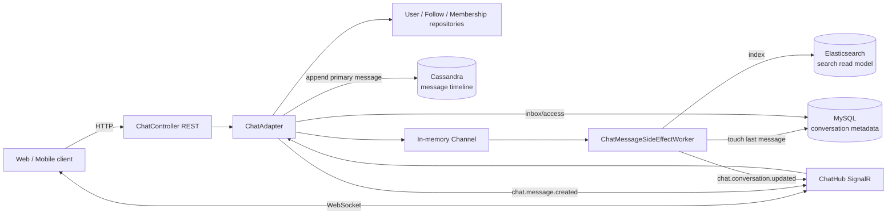
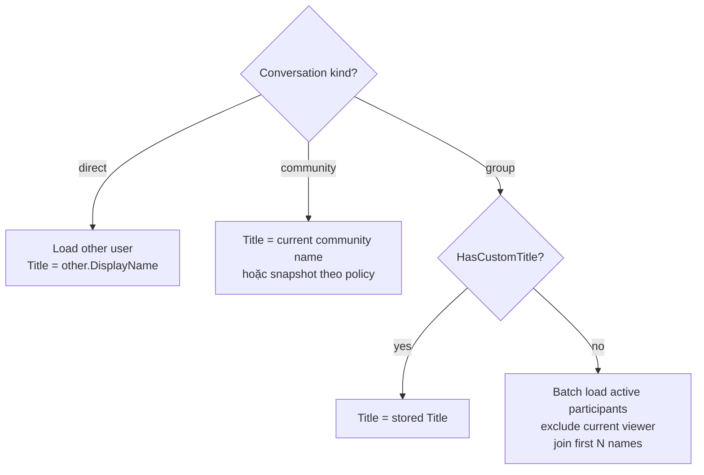
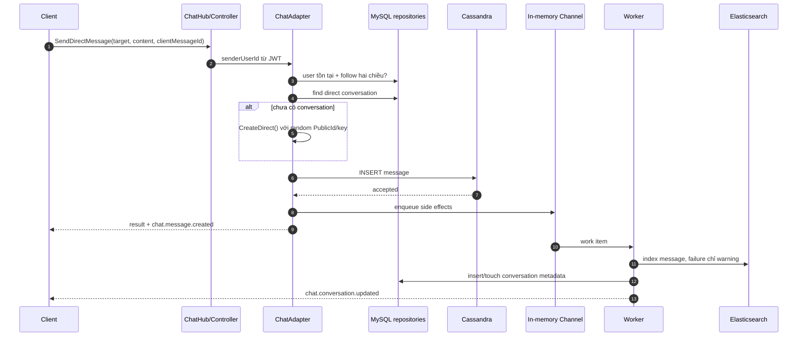
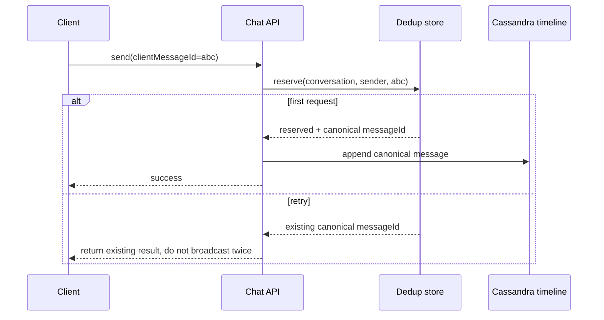
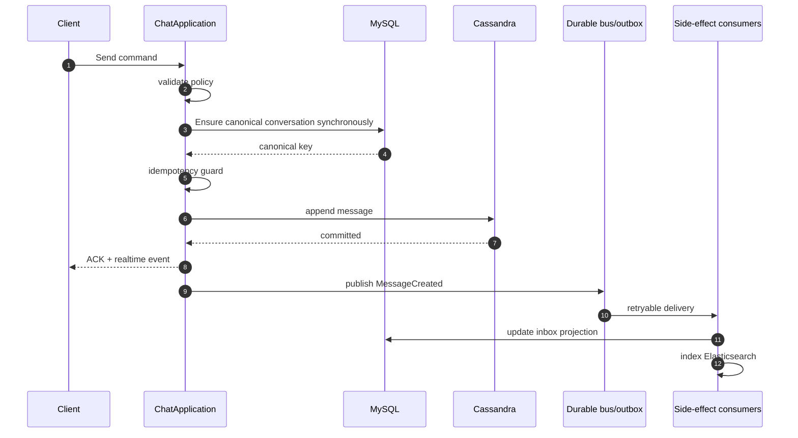
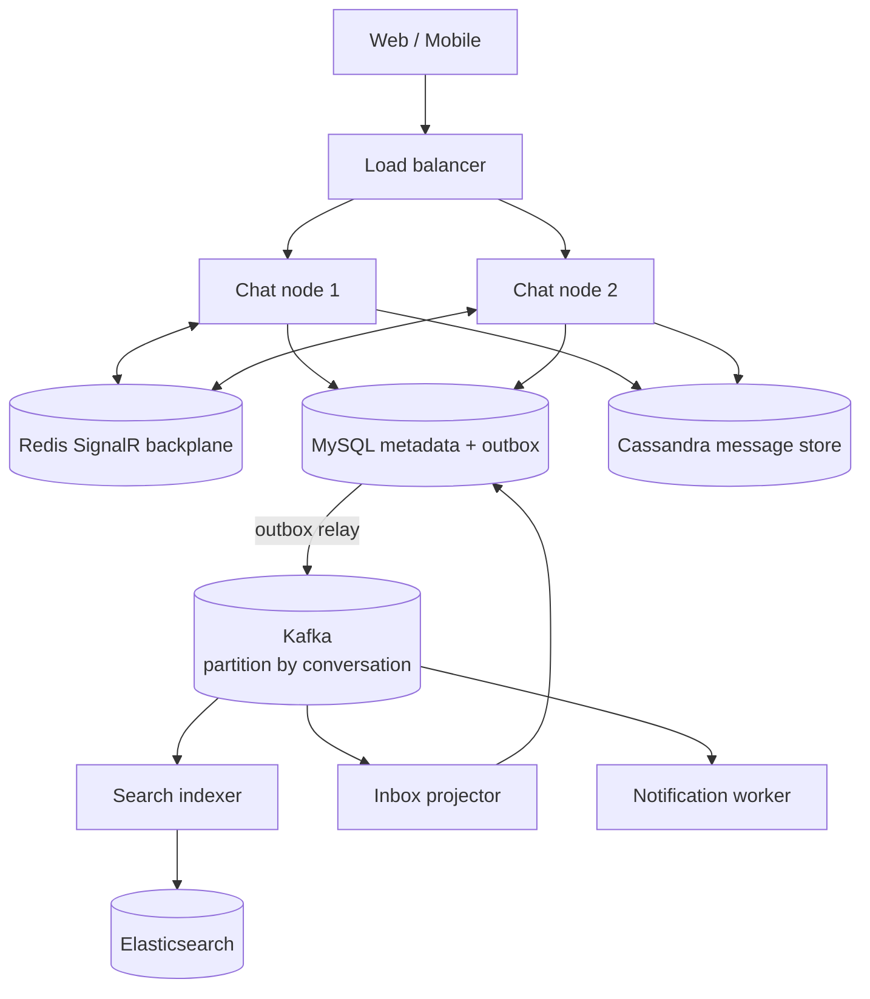

# Seminar: Reverse engineering và thiết kế hệ thống Chat cho SocialTech

> Phiên bản tài liệu: 2026-07-01  
> Phạm vi khảo sát: source code hiện tại của `SocialBackEnd`  
> Mục tiêu: hiểu đúng hệ thống đang chạy, thấy các race condition, và có lộ trình nâng cấp từ demo lên production.

## 1. Kết quả cần đạt sau buổi seminar

Sau tài liệu này, bạn có thể:

- giải thích vì sao metadata hội thoại nằm ở MySQL, message timeline nằm ở Cassandra và search document nằm ở Elasticsearch;
- phân biệt đúng `direct`, `group`, `community` ở cả domain, authorization và UI title;
- lần theo một message từ SignalR/REST đến Cassandra, background worker, MySQL, Elasticsearch và client;
- hiểu consistency, idempotency, ordering, retry, backpressure và hot partition trong một hệ thống chat;
- nhận ra các lỗi đang có trong code hiện tại và áp dụng các bản sửa mẫu;
- mở rộng cùng kiến trúc sang tìm bài viết, trang cá nhân và các loại search khác.

## 2. Executive summary

Kiến trúc hiện tại đi đúng hướng polyglot persistence:

- **MySQL + EF Core** giữ conversation metadata, participant, quyền truy cập và inbox projection.
- **Cassandra** giữ message timeline, tối ưu append và đọc theo `conversation_key` + thời gian.
- **Elasticsearch** là read model phục vụ full-text search.
- **SignalR** truyền message và cập nhật inbox real-time.
- **Channel + BackgroundService** chạy indexing và cập nhật metadata ngoài request chính.

Tuy nhiên, có bốn điểm phải xử lý trước khi coi luồng là production-safe:

1. Conversation mới được ghi MySQL **sau** Cassandra qua in-memory queue. Hai message đầu gửi gần nhau có thể tạo hai conversation key; client join ngay có thể bị từ chối.
2. Queue là `Channel.CreateUnbounded`, không durable, không retry và mất dữ liệu khi process restart.
3. `ClientMessageId` được lưu nhưng chưa tạo idempotency; retry từ client vẫn sinh message trùng.
4. Khi đọc từ Cassandra/Elasticsearch, entity được tạo lại bằng `Guid.NewGuid()`, làm sai `MessageId` gốc.

Định hướng ngắn hạn hợp lý nhất là: **ensure conversation đồng bộ → append Cassandra → broadcast message → enqueue side effects**, sau đó thay in-memory queue bằng Kafka/outbox khi cần độ bền.

## 3. Bản đồ source code

| Vai trò | File chính |
|---|---|
| Domain conversation | `Domain/Entities/ChatConversation.cs` |
| Domain message | `Domain/Entities/ChatMessage.cs` |
| Application orchestration | `Application/Services/ChatAdapter.cs` |
| Inbound contract | `Application/Ports/Inbound/chat/IChat.cs` |
| SignalR transport | `Infrastructure/chat/ChatHub.cs` |
| REST transport | `Presentation/Controllers/ChatController.cs` |
| Conversation repository | `Infrastructure/Persistence/Repositories/ChatConversationRepository.cs` |
| Cassandra timeline | `Infrastructure/chat/CassandraChatMessageStore.cs` |
| Cassandra bootstrap | `Infrastructure/chat/CassandraSessionProvider.cs` |
| Search adapter | `Infrastructure/Elasticsearch/ElasticsearchChatSearchIndex.cs` |
| Async side effects | `Infrastructure/chat/ChatMessageSideEffectQueue.cs`, `ChatMessageSideEffectWorker.cs` |
| Title resolver | `Infrastructure/chat/ChatConversationSummaryBuilder.cs` |
| DI | `DependencyInjection/ServiceDependencyInjection.cs` |
| Local infrastructure | `docker-compose.yml`, `appsettings.json` |

Đây là biến thể của **Hexagonal Architecture**: application phụ thuộc vào port; Cassandra, Elasticsearch, EF Core và SignalR là adapter. Hiện tại `ChatAdapter` vẫn tham chiếu trực tiếp `ChatHub`, nên biên hexagonal chưa hoàn toàn sạch. Có thể tách `IChatRealtimePublisher` nếu cần test application độc lập transport.

## 4. Kiến trúc hiện tại nhìn từ trên cao



Điểm quan trọng: Cassandra hiện là nguồn ghi chính của **message**, nhưng MySQL vẫn là nguồn quyết định user có được đọc/join conversation hay không. Vì vậy metadata conversation phải tồn tại trước khi client dùng key.

## 5. Ngôn ngữ domain: direct, group, community

| Kind | Thành viên | Quyền gửi/đọc | Title mặc định | Vòng đời |
|---|---|---|---|---|
| `direct` | đúng hai user | participant; gửi mới còn yêu cầu follow hai chiều | tên **người còn lại**, phụ thuộc viewer | một conversation cho một cặp user |
| `group` | danh sách participant riêng | participant có `LeftAtUtc == null` | tên các thành viên khác nếu chưa đặt custom title | tạo chủ động, có thể rename/add/leave |
| `community` | không copy toàn bộ member vào participant | membership của community phải `Active` | tên community | một conversation gắn với một community |

### 5.1 Tại sao không nên encode type vào conversation key?

Key kiểu `direct:1:9` làm lộ cấu trúc, buộc client hiểu business rule và khiến migration khó. Code mới dùng:

```csharp
PublicId = Guid.NewGuid();
ConversationKey = PublicId.ToString("N");
```

Đây là opaque identifier: client chỉ lưu và gửi lại, không parse. Type phải lấy từ `ConversationType` trong API response.

Lưu ý migration hiện tại chỉ tạo `PublicId`; nó **không rewrite các `ConversationKey` cũ**. Nếu muốn đổi key của dữ liệu cũ, phải migrate đồng thời MySQL, Cassandra và Elasticsearch hoặc duy trì bảng alias `old_key -> new_key`. Không được đổi riêng MySQL vì lịch sử Cassandra sẽ trở nên “mất”.

## 6. Entity và invariant

```mermaid
erDiagram
    CHAT_CONVERSATION ||--o{ CHAT_PARTICIPANT : contains
    CHAT_CONVERSATION {
        int Id PK
        uuid PublicId UK
        string ConversationKey UK
        int Kind
        int CreatedByUserId
        int CommunityId nullable
        int DirectUserLowId nullable
        int DirectUserHighId nullable
        string Title nullable
        bool HasCustomTitle
        string LastMessagePreview nullable
        int LastMessageSenderUserId nullable
        datetime LastMessageAtUtc nullable
    }
    CHAT_PARTICIPANT {
        int Id PK
        int ConversationId FK
        int UserId
        datetime JoinedAtUtc
        datetime LeftAtUtc nullable
        datetime LastReadAtUtc nullable
        bool IsMuted
    }
    COMMUNITY ||--o{ COMMUNITY_MEMBERSHIP : has
    COMMUNITY ||--o| CHAT_CONVERSATION : owns
    COMMUNITY_MEMBERSHIP {
        int CommunityId
        int UserId
        int Status
        int Role
    }
```

Invariant nên được bảo vệ ở ba tầng:

- Domain: không direct với chính mình; group ít nhất ba người; direct không rename.
- Database: unique key chống race; foreign key và length.
- Application: user tồn tại, follow policy, membership policy, sender có quyền access.

Các index hiện tại cho direct pair và community chưa unique. Nên sửa:

```csharp
builder.HasIndex(x => new { x.Kind, x.DirectUserLowId, x.DirectUserHighId })
    .IsUnique();

builder.HasIndex(x => new { x.Kind, x.CommunityId })
    .IsUnique();
```

MySQL cho phép nhiều `NULL` trong unique index, nên các kind không dùng field đó vẫn cùng tồn tại. Trước khi migrate, phải dò và hợp nhất duplicate.

## 7. Title: dữ liệu hay projection?

Title là nguyên nhân dễ sai vì không phải loại nào cũng là dữ liệu tĩnh.



### 7.1 Quy tắc đề xuất

- Direct: không lưu title; resolve theo viewer.
- Group custom: lưu title và `HasCustomTitle = true`.
- Group chưa custom: resolve từ participant đang active, bỏ current user.
- Community: nên resolve từ `Community.Name` để rename phản ánh ngay. Chỉ lưu snapshot nếu product thực sự muốn title chat độc lập.

`ChatConversationSummaryBuilder` hiện đã xử lý direct và group theo viewer. Điểm tối ưu cần làm là thay vòng `foreach RequireUserAsync` bằng batch query `GetByIdsAsync`, tránh N+1 query.

Ví dụ resolver thuần, dễ test:

```csharp
public static string ResolveGroupTitle(
    string? storedTitle,
    bool hasCustomTitle,
    int viewerId,
    IReadOnlyDictionary<int, string> names,
    IEnumerable<int> activeParticipantIds)
{
    if (hasCustomTitle) return storedTitle ?? string.Empty;

    return string.Join(", ", activeParticipantIds
        .Where(id => id != viewerId)
        .Distinct()
        .Where(names.ContainsKey)
        .Take(3)
        .Select(id => names[id]));
}
```

## 8. Reverse engineering các luồng hiện tại

### 8.1 Connect và subscribe

1. Client kết nối `/chatHub` bằng JWT.
2. `OnConnectedAsync` lấy `Context.UserIdentifier`.
3. Connection được add vào group `user:{userId}` để nhận inbox update.
4. Khi mở màn hình conversation, client gọi `JoinConversation(conversationKey)`.
5. Server gọi `EnsureConversationAccessAsync`; chỉ sau khi pass mới add group `conversation:{key}`.

Không được cho client tự quyết group name. Authorization phải luôn chạy phía server.

### 8.2 Gửi direct message hiện tại



Race condition nằm giữa bước Cassandra và worker:

- request kế tiếp chưa thấy conversation trong MySQL, tạo key mới;
- `JoinConversation(key)` ngay sau response có thể trả access denied;
- app restart làm item trong Channel biến mất; message còn ở Cassandra nhưng inbox/search không biết.

### 8.3 Community

Community không dùng `ChatConversationParticipants` để authorize. Mỗi lần send/read/join, server kiểm tra `CommunityMembership.Status == Active`. Đây là lựa chọn tốt vì tránh fan-out hàng triệu participant row và phản ánh ban/kick ngay.

Policy cần quyết định rõ:

- member rời community có được đọc lịch sử cũ không?
- moderator bị suspend có được search message không?
- private community có cho preview trong notification không?

Code hiện tại chọn policy đơn giản: chỉ active member mới access toàn bộ.

### 8.4 Group

Group được tạo đồng bộ vào MySQL trước khi send, nên không có race “metadata chưa tồn tại” giống direct/community. Quyền dựa trên participant active. Các chức năng còn thiếu để hoàn chỉnh aggregate: rename, add member, leave/remove member, role admin, membership event và unread count.

### 8.5 Read timeline

`GetMessagesAsync`:

1. check access bằng MySQL/community membership;
2. query Cassandra theo `conversation_key`, optional `sent_at_utc < beforeUtc`;
3. sort lại tăng dần để UI render;
4. lookup sender name và map DTO.

Cursor chỉ dùng timestamp có thể bỏ sót/trùng nếu nhiều message cùng timestamp. Cursor an toàn nên là tuple `(sentAtUtc, messageId)` và query theo đúng clustering order.

## 9. Cassandra: thiết kế theo query

Schema hiện tại:

```sql
CREATE TABLE chat_messages_by_conversation (
  conversation_key text,
  sent_at_utc timestamp,
  message_id uuid,
  sender_user_id int,
  content text,
  client_message_id text,
  reply_to_message_id uuid,
  edited_at_utc timestamp,
  deleted_at_utc timestamp,
  state text,
  PRIMARY KEY ((conversation_key), sent_at_utc, message_id)
) WITH CLUSTERING ORDER BY (sent_at_utc DESC, message_id DESC);
```

Thiết kế này đúng với query “lấy message mới nhất của một conversation”. Cassandra nên được model theo query, không theo normalization kiểu relational.

### 9.1 Lỗi rehydrate làm đổi MessageId

`MapMessage` gọi `ChatMessage.Create`, trong khi factory tự `Guid.NewGuid()`. Cột `message_id` đã select nhưng không được gán. Search adapter cũng mắc lỗi tương tự.

Sửa entity bằng factory rehydrate:

```csharp
public static ChatMessage Rehydrate(
    Guid messageId,
    string conversationKey,
    int senderUserId,
    string content,
    string? clientMessageId,
    Guid? replyToMessageId,
    ChatMessageState state,
    DateTimeOffset sentAtUtc,
    DateTimeOffset? editedAtUtc,
    DateTimeOffset? deletedAtUtc)
{
    return new ChatMessage
    {
        MessageId = messageId,
        ConversationKey = conversationKey,
        SenderUserId = senderUserId,
        Content = content,
        ClientMessageId = clientMessageId,
        ReplyToMessageId = replyToMessageId,
        State = state,
        SentAtUtc = sentAtUtc,
        EditedAtUtc = editedAtUtc,
        DeletedAtUtc = deletedAtUtc
    };
}
```

Sau đó mapper phải đọc `row.GetValue<Guid>("message_id")`. Factory này thuộc domain và không validate như create-new, vì dữ liệu đã tồn tại.

### 9.2 Prepared statement

Code hiện dùng `SimpleStatement` mỗi request. Nên prepare một lần và bind nhiều lần:

```csharp
private PreparedStatement? _append;

private async Task<PreparedStatement> GetAppendStatementAsync(ISession session)
{
    return _append ??= await session.PrepareAsync("""
        INSERT INTO chat_messages_by_conversation
        (conversation_key, sent_at_utc, message_id, sender_user_id, content,
         client_message_id, reply_to_message_id, edited_at_utc, deleted_at_utc, state)
        VALUES (?, ?, ?, ?, ?, ?, ?, ?, ?, ?)
        """);
}
```

Trong production, dùng async lock/Lazy task để tránh prepare race và đặt consistency level theo SLA.

### 9.3 Hot partition và time bucket

Một community lớn có thể dồn mọi write vào partition `conversation_key`. Khi partition vượt ngưỡng vận hành, thêm bucket:

```sql
PRIMARY KEY ((conversation_key, bucket_yyyymm), sent_at_utc, message_id)
```

Đọc trang gần nhất: query bucket hiện tại; thiếu số lượng thì đọc bucket trước. Không bucket quá sớm vì application sẽ phức tạp hơn. Quyết định bằng metric partition size, message rate và latency thực tế.

### 9.4 Keyspace

Provider hiện hard-code `socialtech_chat` và `SimpleStrategy`, dù options có `Keyspace`. Local single-node chấp nhận được. Production multi-datacenter nên dùng `NetworkTopologyStrategy`, replication factor phù hợp và migration/schema management riêng thay vì web process tự tạo schema.

## 10. Idempotency: retry không được tạo message mới

`ClientMessageId` chỉ là dữ liệu nếu backend không enforce uniqueness.



Dedup table gợi ý:

```sql
CREATE TABLE message_dedup_by_conversation (
  conversation_key text,
  sender_user_id int,
  client_message_id text,
  message_id uuid,
  sent_at_utc timestamp,
  PRIMARY KEY ((conversation_key), sender_user_id, client_message_id)
);
```

Reserve bằng `INSERT ... IF NOT EXISTS`. LWT có chi phí; chỉ dùng tại điểm thật sự cần compare-and-set. Consumer Elasticsearch/MySQL cũng phải idempotent theo `MessageId`, vì delivery event nên được giả định là **at least once**.

Frontend phải tạo UUID một lần khi user nhấn Send và giữ nguyên UUID đó trong mọi retry. Không tạo lại ở mỗi network attempt.

## 11. Consistency và thứ tự ghi đề xuất

### 11.1 Luồng ngắn hạn an toàn hơn



“Ensure canonical conversation” phải xử lý duplicate-key race bằng cách query lại theo direct pair/community id, không query lại theo random key vừa thua race.

```csharp
private async Task<ChatConversation> GetOrCreateDirectAsync(
    int firstUserId, int secondUserId, CancellationToken ct)
{
    var existing = await repository.GetDirectConversationAsync(firstUserId, secondUserId, ct);
    if (existing is not null) return existing;

    var candidate = ChatConversation.CreateDirect(firstUserId, secondUserId, firstUserId);
    try
    {
        await repository.AddAsync(candidate, ct);
        await repository.SaveChangesAsync(ct);
        return candidate;
    }
    catch (DbUpdateException)
    {
        repository.ClearTracking();
        return await repository.GetDirectConversationAsync(firstUserId, secondUserId, ct)
            ?? throw;
    }
}
```

### 11.2 Không có distributed transaction miễn phí

MySQL và Cassandra không cùng một ACID transaction. Ta phải chọn failure semantics:

| Sự cố | Hành vi mong muốn |
|---|---|
| MySQL ensure conversation fail | không ghi Cassandra |
| Cassandra append fail | trả lỗi/retry; conversation rỗng có thể tồn tại |
| realtime broadcast fail | message vẫn committed, client reload timeline |
| Elasticsearch down | send vẫn thành công; consumer retry/reindex |
| inbox projection fail | send vẫn thành công; retry/rebuild từ event/message |

Conversation rỗng dễ cleanup hơn message mồ côi với key không authorize được.

## 12. Queue, worker và backpressure

`Channel<T>` rất tốt cho bản local/monolith vì nhẹ. Nhưng queue hiện tại:

- unbounded: producer nhanh hơn consumer sẽ tăng RAM;
- single reader: Elasticsearch chậm kéo chậm cả metadata update;
- memory-only: restart mất item;
- catch/log rồi bỏ: không retry, không dead-letter.

Bản cải thiện tối thiểu:

```csharp
private readonly Channel<ChatMessageSideEffectWorkItem> _channel =
    Channel.CreateBounded<ChatMessageSideEffectWorkItem>(
        new BoundedChannelOptions(10_000)
        {
            SingleReader = false,
            SingleWriter = false,
            FullMode = BoundedChannelFullMode.Wait,
            AllowSynchronousContinuations = false
        });
```

Không dùng cancellation token của connection cho side effect sau commit; client disconnect không được làm mất công việc server. Nhưng bounded in-memory queue vẫn không durable. Khi yêu cầu production, dùng Kafka đã có trong stack hoặc transactional outbox ở MySQL.

Partition Kafka theo `ConversationKey` để giữ ordering trong conversation. Consumer dùng `MessageId` làm idempotency key. Tách topic/consumer group cho `inbox-projector`, `search-indexer`, `notification` để Elasticsearch chậm không giữ MySQL projection.

## 13. Elasticsearch và lỗi product check

Lỗi “client is unable to verify that the server is Elasticsearch” xảy ra trước indexing, tại `GET /`. Các nguyên nhân cần kiểm theo thứ tự:

1. container chưa healthy hoặc port host sai;
2. server bật TLS nhưng app gọi `http://`;
3. server cần Basic Authentication nhưng app để username/password rỗng;
4. major version client/server lệch; project đang dùng legacy `NEST 7.17.5`;
5. URL trỏ nhầm proxy/service không phải Elasticsearch.

Code đã chuyển indexing sang side effect để Elasticsearch down không làm fail send. Đó là **fault isolation**, chưa phải recovery; vẫn cần retry/rebuild.

### 13.1 Local compose đơn giản, đồng nhất protocol

Ví dụ local-only, không dùng cho production:

```yaml
elasticsearch:
  image: docker.elastic.co/elasticsearch/elasticsearch:7.17.5
  environment:
    - discovery.type=single-node
    - xpack.security.enabled=false
    - ES_JAVA_OPTS=-Xms512m -Xmx512m
  ports:
    - "9200:9200"
  volumes:
    - es-data:/usr/share/elasticsearch/data
  networks:
    - SocialNetwork
```

Phương án dài hạn là nâng sang client .NET hiện hành cùng major với server và bật security đúng chuẩn. Không nên giữ NEST 7 như chiến lược lâu dài khi cluster đã lên major mới.

### 13.2 Mapping và alias

Code có `DefaultIndex = chats` nhưng adapter lại hard-code `socialtech-messages-v1`. Chọn một nguồn cấu hình và dùng alias:

- alias đọc/ghi: `chat-messages`;
- physical index: `chat-messages-v1`, `v2`;
- reindex sang v2 rồi atomically switch alias.

Mapping tối thiểu:

```json
{
  "mappings": {
    "properties": {
      "message_id":      { "type": "keyword" },
      "conversation_key":{ "type": "keyword" },
      "sender_user_id":  { "type": "integer" },
      "content":         { "type": "text" },
      "state":           { "type": "keyword" },
      "sent_at_utc":     { "type": "date" }
    }
  }
}
```

Không gọi `EnsureIndexAsync` cho từng message. Tạo index/template khi deploy hoặc dùng một initializer có lock. Bulk API cho reindex/backfill.

### 13.3 Search message an toàn

Luồng đúng là:

1. authorize conversation bằng source of truth;
2. filter `conversation_key` bằng keyword;
3. filter state không deleted;
4. full-text match content;
5. trả canonical `message_id`, highlight và sort/cursor nếu cần.

Elasticsearch chỉ là derived read model. Không dùng kết quả Elasticsearch để quyết định quyền truy cập.

### 13.4 Mở rộng tìm bài viết và trang cá nhân

Không nhét mọi entity vào một mapping `chats`. Dùng index/alias riêng:

| Alias | Document | Search fields | Filter fields |
|---|---|---|---|
| `chat-messages` | message | content, sender name snapshot | conversation, sender, state, time |
| `posts` | post | title, body, tags | visibility, community, author, status |
| `profiles` | user profile | display name, bio | active, location, privacy |

Mỗi document phải có `source_version` hoặc `updated_at`. Consumer chỉ apply event mới hơn để event đến trễ không overwrite document mới.

## 14. SignalR contract cho frontend

### 14.1 Client lifecycle

```javascript
const connection = new signalR.HubConnectionBuilder()
  .withUrl("/chatHub", { accessTokenFactory: () => accessToken })
  .withAutomaticReconnect()
  .build();

connection.on("chat.message.created", message => upsertMessage(message));
connection.on("chat.conversation.updated", summary => upsertInbox(summary));

await connection.start();
const inbox = await connection.invoke("GetInbox");

await connection.invoke("JoinConversation", conversationKey);
const history = await connection.invoke("GetMessages", conversationKey, 50, null);
```

Khi gửi:

```javascript
const clientMessageId = crypto.randomUUID();
const result = await connection.invoke("SendDirectMessage", {
  targetUserId: 42,
  content: "Xin chào",
  clientMessageId
});
```

Frontend dùng `upsert` theo canonical `MessageId`, không append mù. Sau reconnect, gọi lại inbox/timeline vì realtime delivery không phải durable history.

### 14.2 Event naming/versioning

Khi nhiều client version cùng tồn tại, nên dùng envelope:

```json
{
  "eventId": "uuid",
  "eventType": "chat.message.created.v1",
  "occurredAtUtc": "2026-07-01T10:00:00Z",
  "payload": {}
}
```

## 15. Các lỗi cụ thể đang thấy trong repository

### P0 — ảnh hưởng tính đúng

- Persist conversation mới quá muộn qua queue, tạo race split conversation/access denied.
- Direct/community index trong MySQL chưa unique.
- Cassandra mapper và Elasticsearch search làm đổi `MessageId`.
- Chưa enforce idempotency theo `ClientMessageId`.
- In-memory queue mất item khi restart và không retry.

### P1 — ảnh hưởng chức năng/hiệu năng

- Group title lookup N+1 user query.
- Community title là snapshot, có thể stale sau rename.
- Cursor chỉ có timestamp.
- Index name hard-code khác config; ensure-index chạy mỗi operation.
- Search document không được update khi edit/delete.
- `EditMessageRequest.MessageId` là `int` trong khi domain dùng `Guid`.
- Edit/delete controller hiện chỉ trả `Ok()` và route delete chứa literal `${messageId:int}`.
- Side-effect worker xử lý tuần tự và không có dead-letter.

### P2 — maintainability/production readiness

- `Convertstation` bị typo; nên migrate tên code thành `Conversation`.
- Một số comment/source bị lỗi encoding UTF-8.
- Cassandra schema hard-code keyspace, local strategy và tự bootstrap trong web app.
- SignalR chưa có Redis backplane; scale nhiều app instance sẽ không broadcast đầy đủ.
- Thiếu metrics, tracing và health checks cho Cassandra/Elasticsearch/queue lag.

## 16. Thiết kế mục tiêu theo quy mô



### Lộ trình thay vì “big bang”

1. **Correctness:** sync ensure conversation, unique indexes, rehydrate ID, idempotency.
2. **Resilience:** bounded queue + retry; sau đó Kafka/outbox + DLQ.
3. **Performance:** batch user lookup, prepared Cassandra statements, ES bulk/index template.
4. **Scale-out:** Redis SignalR backplane, stateless app nodes, topic partitioning.
5. **Large communities:** Cassandra time bucket, inbox projection riêng, fan-out strategy theo quy mô.

## 17. Fan-out, inbox và unread count

Worker hiện loop từng group participant để build summary và send. Với group nhỏ ổn; group/community lớn sẽ đắt.

Hai chiến lược:

- **Fan-out on write:** update inbox row cho từng user. Đọc nhanh, write amplification lớn.
- **Fan-out on read:** giữ conversation head một lần, join membership khi đọc. Write rẻ, inbox read phức tạp.

SocialTech có thể hybrid:

- direct/group nhỏ: fan-out on write;
- community lớn: fan-out on read + membership cursor;
- unread count: lưu `LastReadAtUtc` hoặc last-read message cursor, không increment/decrement thiếu idempotency.

Nếu cần exact unread count ở quy mô lớn, projection consumer phải idempotent và có reconciliation job. Nếu chỉ cần badge gần đúng, cache có thể chấp nhận eventual consistency.

## 18. Edit/delete message đúng cách

Cassandra không phù hợp “load entity rồi mutate” như EF. Thiết kế query và mutation rõ:

- chỉ sender/moderator được edit/delete;
- locate row cần đầy đủ clustering key `(conversation, bucket?, sentAt, messageId)`;
- soft delete: giữ row, set state/deleted time/content policy;
- publish `MessageEdited`/`MessageDeleted`;
- Elasticsearch update/delete document theo canonical MessageId;
- SignalR gửi event để client upsert.

DTO phải dùng `Guid` hoặc string GUID:

```csharp
public sealed record EditMessageRequest(
    string ConversationKey,
    Guid MessageId,
    DateTimeOffset SentAtUtc,
    string NewContent);
```

Route đúng:

```csharp
[HttpDelete("message/{messageId:guid}")]
public Task<IActionResult> DeleteMessage(Guid messageId, ...)
```

## 19. Security checklist

- Lấy sender ID từ JWT, không nhận từ request body.
- Authorize mọi read/search/join/send; không chỉ authorize Hub connect.
- Validate độ dài content, attachment type/size và rate limit theo user/conversation.
- Escape/render text an toàn ở frontend để tránh stored XSS.
- Không log plaintext message hoặc token ở production.
- Community ban/kick phải có hiệu lực với connection đang join; có thể remove group hoặc check lại ở command tiếp theo.
- Elasticsearch index không public ra internet; cấp least-privilege credential cho app/indexer.
- Secret nằm trong environment/secret manager, không commit appsettings production.

## 20. Observability và SLO

Nên đo:

- `chat_send_duration_ms` p50/p95/p99;
- Cassandra append/read latency và timeout;
- queue depth/oldest item age hoặc Kafka consumer lag;
- side-effect retry/DLQ count;
- Elasticsearch indexing latency/error và search latency;
- conversation duplicate count;
- SignalR active connections/reconnect rate;
- message ACK-to-visible latency.

Mỗi send nên có `CorrelationId`, `MessageId`, `ConversationKey` trong structured log, nhưng không log content. Trace span tách `authorize`, `ensure-conversation`, `cassandra-append`, `publish-event`.

Health check nên phân biệt:

- **liveness:** process còn sống;
- **readiness:** dependency bắt buộc cho send (MySQL/Cassandra) sẵn sàng;
- Elasticsearch down không nhất thiết làm app unready nếu search degradation được chấp nhận.

## 21. Test strategy

### Unit test

- direct low/high IDs luôn canonical;
- direct self-chat bị reject;
- group dưới ba participant bị reject;
- title direct phụ thuộc viewer;
- title group loại viewer, custom title được ưu tiên;
- community active/inactive policy.

### Integration test

- Cassandra append rồi read giữ nguyên `MessageId`;
- pagination không mất message cùng timestamp;
- duplicate `ClientMessageId` chỉ có một canonical message;
- Elasticsearch down vẫn send được;
- search không leak conversation không có quyền;
- community leave lập tức mất access.

### Concurrency test quan trọng nhất

Chạy 50 request tạo direct chat cùng một cặp user; assert:

- MySQL chỉ có một conversation;
- mọi response trả cùng `ConversationKey`;
- Cassandra timeline chỉ thuộc key đó;
- retry cùng `ClientMessageId` không tăng message count.

### Chaos test

- kill Elasticsearch lúc gửi;
- restart app khi event đang chờ;
- delay MySQL/Cassandra;
- duplicate và reorder Kafka event;
- reconnect SignalR liên tục.

## 22. Runbook debug nhanh

### Send thất bại

1. Xác nhận JWT `NameIdentifier`/`UserIdentifier`.
2. Kiểm tra follow hoặc community/group membership.
3. Kiểm tra canonical conversation trong MySQL.
4. Query Cassandra theo exact key.
5. Kiểm tra worker lag/log; không kết luận send fail chỉ vì Elasticsearch fail.

### Elasticsearch product check

```powershell
Invoke-WebRequest http://localhost:9200 -UseBasicParsing
docker compose ps
docker compose logs es01 --tail 200
```

Nếu response yêu cầu HTTPS/auth, sửa `Elasticsearch:Uri`, username/password/certificate theo đúng server. Đồng thời kiểm major version image và .NET client.

### Cassandra

```powershell
docker compose ps
docker compose logs ChatNodeVNArea --tail 200
docker exec -it cassandra1 cqlsh
```

Trong `cqlsh`:

```sql
DESCRIBE KEYSPACE socialtech_chat;
SELECT * FROM socialtech_chat.chat_messages_by_conversation
WHERE conversation_key = '...'
LIMIT 20;
```

## 23. Definition of Done cho chat production-ready

- [ ] Direct/community conversation được ensure đồng bộ và có unique constraint.
- [ ] Cassandra/Elasticsearch rehydrate giữ canonical MessageId.
- [ ] `ClientMessageId` có idempotency test dưới concurrency.
- [ ] Queue/event durable hoặc có reconciliation job được chứng minh.
- [ ] ES down không ảnh hưởng send và có cơ chế backfill.
- [ ] Title đúng cho mỗi viewer, không N+1.
- [ ] Pagination dùng stable cursor.
- [ ] Edit/delete đồng bộ Cassandra, ES và realtime.
- [ ] SignalR scale-out có backplane khi chạy nhiều instance.
- [ ] Metrics, tracing, health check, load test và chaos test đạt SLO.

## 24. Tài liệu thư viện nên đọc tiếp

- Microsoft: SignalR scale-out và Redis backplane: <https://learn.microsoft.com/aspnet/core/signalr/redis-backplane>
- Microsoft: `System.Threading.Channels` và bounded backpressure: <https://learn.microsoft.com/dotnet/core/extensions/channels>
- Apache Cassandra: query-driven data modeling: <https://cassandra.apache.org/doc/stable/cassandra/developing/data-modeling/>
- Apache Cassandra: đánh giá partition size: <https://cassandra.apache.org/doc/4.1/cassandra/data_modeling/data_modeling_refining.html>
- Elastic: .NET client usage recommendations: <https://www.elastic.co/docs/reference/elasticsearch/clients/dotnet/recommendations>
- Elastic: REST API compatibility chỉ là cầu nối khi upgrade: <https://www.elastic.co/docs/reference/elasticsearch/rest-apis/compatibility>

## 25. Kết luận

Một hệ thống chat không khó nhất ở WebSocket; phần khó là giữ một sự thật nhất quán vừa đủ giữa nhiều storage khi retry, crash và scale-out xảy ra. Cách tư duy nên là:

1. xác định source of truth cho từng loại dữ liệu;
2. đặt invariant vào domain và unique constraint;
3. thiết kế Cassandra từ query;
4. coi Elasticsearch/inbox là projection có thể rebuild;
5. coi mọi delivery là có thể duplicate;
6. ưu tiên canonical ID, idempotency và observability trước tối ưu throughput.

Nếu sáu nguyên tắc này được giữ, kiến trúc có thể lớn dần mà không phải viết lại toàn bộ mỗi khi thêm group, community, search hay notification.
