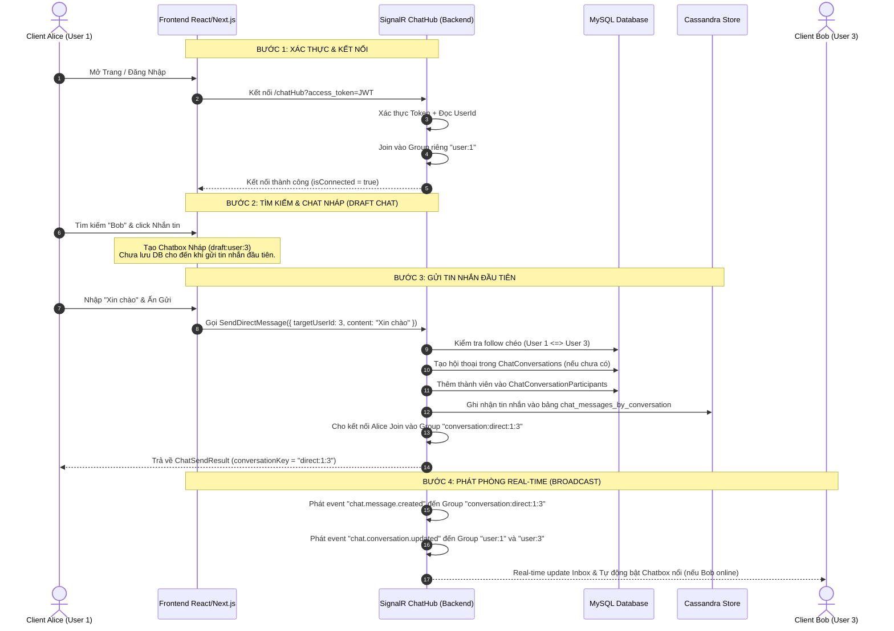

# Hướng Dẫn Kỹ Thuật & Kiến Trúc Hệ Thống Chat Real-time

Tài liệu này mô tả chi tiết về kiến trúc hoạt động, luồng xử lý dữ liệu, cách bảo trì và các hướng mở rộng tiềm năng cho hệ thống Chat Messenger-style (bao gồm Popover danh sách chat ở AppHeader và các Chatbox nổi ở góc dưới bên phải màn hình).

---

## 1. Kiến Trúc & Luồng Hoạt Động (Chat Flow Architecture)

Hệ thống chat được xây dựng trên sự kết hợp giữa **SignalR (Real-time Hub)**, **MySQL (Metadata & Room State)** và **Cassandra (Message Store)**.

### Sơ Đồ Kiến Trúc Luồng Chat


### Các Luồng Xử Lý Chi Tiết

#### A. Luồng Xác Thực và Kết Nối (Authentication & Connection)
1. **Frontend**: Sử dụng hook `useEffect` trong [chat-provider.tsx](file:///d:/Training/01-SocialTech/SocialFrontend/social-tech-fe/src/providers/chat-provider.tsx) lắng nghe trạng thái đăng nhập. Khi có `accessToken`, client xây dựng kết nối SignalR qua `/chatHub` đính kèm Token trong query string.
2. **Backend**: Middleware JWT Bearer chặn kết nối tại [SecurityConfigurationExtensions.cs](file:///d:/Training/01-SocialTech/SocialBackEndW/SocialBackEnd/Infrastructure/Security/SecurityConfigurationExtensions.cs) để trích xuất token tự động từ Query String đối với các kết nối SignalR:
   ```csharp
   if (!string.IsNullOrWhiteSpace(accessToken) &&
       (path.StartsWithSegments("/notificationHub") || path.StartsWithSegments("/chatHub")))
   {
       context.Token = accessToken;
   }
   ```
3. **ChatHub**: Hàm `OnConnectedAsync` trong [ChatHub.cs](file:///d:/Training/01-SocialTech/SocialBackEndW/SocialBackEnd/Infrastructure/chat/ChatHub.cs) lấy ra `UserIdentifier` (UserId) và tự động đăng ký ConnectionId hiện hành vào Group cá nhân:
   ```csharp
   await Groups.AddToGroupAsync(Context.ConnectionId, BuildUserGroupName(userId));
   ```

#### B. Luồng Tạo Hội Thoại Lười (Lazy Conversation Creation)
Để tối ưu hóa không gian lưu trữ và tránh các cuộc hội thoại rác:
* Khi bấm nút nhắn tin cho một người mới từ thanh tìm kiếm hoặc trang cá nhân, frontend chỉ hiển thị **Chatbox Nháp** với mã định danh tạm thời `draft:user:{targetUserId}`.
* Chỉ khi người dùng gửi tin nhắn đầu tiên có nội dung hợp lệ, backend mới tạo bản ghi Conversation và các bản ghi Participant trong MySQL, đồng thời lưu tin nhắn vào Cassandra.
* Khi có kết quả trả về, frontend thực hiện tráo đổi khóa nháp (draft key) thành khóa thực (real key), giúp cập nhật mượt mà giao diện mà không làm gián đoạn trải nghiệm người dùng.

#### C. Luồng Đồng Bộ Lịch Sử & Realtime Event
* **Lấy Inbox**: Đọc danh sách các cuộc trò chuyện từ MySQL (đã được sắp xếp theo thời gian tin nhắn mới nhất giảm dần) thông qua API REST `/api/Chat/inbox` lúc khởi tạo, và lắng nghe cập nhật trực tiếp qua SignalR event `chat.conversation.updated`.
* **Lấy tin nhắn cũ**: Đọc trực tiếp từ Cassandra thông qua hàm `GetMessages` (SignalR) hoặc `/api/Chat/messages` (REST Fallback).
* **Nhận tin nhắn mới**: Khi có tin nhắn mới, backend phát sự kiện `chat.message.created` tới group chat cụ thể. Tất cả client đang mở phòng chat đó sẽ nhận được tin nhắn và đẩy vào danh sách hiển thị thời gian thực.

---

## 2. Các Hướng Phát Triển Tính Năng Tiềm Năng (Extensible Features)

Dựa trên cấu trúc hạ tầng hiện hành (đã có sẵn MinIO, Cassandra, SignalR, Redis), hệ thống chat có thể mở rộng các tính năng cao cấp sau:

### A. Gửi Ảnh & Tệp Đính Kèm (Media Attachments)
* **Giải pháp**: 
  1. Frontend gửi tệp lên MinIO thông qua API upload hiện tại để nhận về đường dẫn lưu trữ.
  2. Frontend gửi tin nhắn chứa đường dẫn ảnh/tệp đính kèm.
  3. Cập nhật Cassandra Schema hoặc trường `content` (lưu dạng JSON string chứa loại tin nhắn và URL) để phân biệt tin nhắn văn bản và tin nhắn đa phương tiện.

### B. Trạng Thái Đã Đọc (Read Receipts)
* **Giải pháp**:
  1. Thêm trường `LastReadAtUtc` vào bảng `ChatConversationParticipants` trong MySQL.
  2. Tạo phương thức `MarkAsRead(conversationKey)` trong `ChatHub.cs`.
  3. Khi gọi phương thức này, backend cập nhật thời gian đọc cuối cùng của user hiện tại vào MySQL và phát sự kiện `chat.conversation.read` đến đối phương để hiển thị icon "Đã xem" (seen icon) tương tự như Facebook Messenger.

### C. Trạng Thái Đang Soạn Thảo (Typing Indicator)
* **Giải pháp**:
  1. Khi người dùng nhập ký tự vào ô chat, frontend phát sự kiện `SendTypingStatus(conversationKey, isTyping: true)` qua SignalR mỗi 2-3 giây.
  2. Backend nhận sự kiện và chuyển tiếp (broadcast) đến những người dùng khác trong group hội thoại (ngoại trừ người gửi) thông qua `.OthersInGroup(...)`.
  3. Frontend đối diện nhận sự kiện và hiển thị ba chấm động nhấp nháy.

### D. Tải Lịch Sử Phân Trang (Infinite Scroll / Pagination)
* **Giải pháp**:
  * Cassandra hiện đang gom cụm dữ liệu theo `sent_at_utc DESC`.
  * Khi người dùng cuộn lên đầu chatbox, frontend gọi `GetMessages` truyền kèm thời gian tin nhắn cũ nhất đang hiển thị (`beforeUtc`).
  * Backend thực hiện truy vấn:
    ```sql
    SELECT * FROM chat_messages_by_conversation 
    WHERE conversation_key = ? AND sent_at_utc < ? 
    LIMIT 20
    ```
    Từ đó trả về 20 tin nhắn tiếp theo giúp tối ưu hiệu năng và băng thông truyền tải.

---

## 3. Quy Trình Bảo Trì & Xử Lý Sự Cố (Maintenance & Troubleshooting)

### Các Cổng Dịch Vụ Cần Giám Sát
Để hệ thống chat hoạt động, tất cả các container và dịch vụ sau phải ở trạng thái hoạt động:
* **MySQL** (Cổng `3306`): Lưu thông tin cấu trúc phòng và người tham gia chat.
* **Cassandra** (Cổng `9042`): Lưu trữ toàn bộ nội dung tin nhắn chat.
* **SignalR Hub** (Cổng `5019`): Cầu nối thời gian thực giữa các client.
* **Redis** (Cổng `6379`): Quản lý cache và session hoạt động.

### Một Số Lỗi Thường Gặp & Cách Khắc Phục

#### 1. Lỗi Không Kết Nối Được Cassandra (`NoHostAvailableException`)
* **Dấu hiệu**: Khi gửi tin nhắn, backend log lỗi không tìm thấy host hoặc connection timeout đến Cassandra.
* **Nguyên nhân**: Trên môi trường Windows, `"localhost"` phân giải thành IPv6 `::1`, nhưng container Cassandra chạy qua Docker mặc định chỉ lắng nghe trên cổng IPv4 `127.0.0.1`.
* **Bảo trì**: Hãy đảm bảo mục `"Cassandra": { "ContactPoints": [ "127.0.0.1" ] }` luôn trỏ tới địa chỉ IP IPv4 cụ thể trong cấu hình [appsettings.json](file:///d:/Training/01-SocialTech/SocialBackEndW/SocialBackEnd/appsettings.json).

#### 2. Lỗi Không Khớp Tham Số SignalR (`InvalidDataException`)
* **Dấu hiệu**: Trình duyệt báo lỗi `Invocation provides 1 argument(s) but target expects 2` tại phương thức `SendDirectMessage`.
* **Nguyên nhân**: Sử dụng `CancellationToken` làm tham số trực tiếp trong signature của Hub Method khiến bộ giải mã tham số của SignalR hiểu lầm client cần truyền thêm đối số thứ hai.
* **Bảo trì**: 
  * Không khai báo `CancellationToken` trong chữ ký phương thức của Hub.
  * Hãy luôn sử dụng thuộc tính có sẵn `Context.ConnectionAborted` của Hub để truyền xuống các phương thức xử lý bất đồng bộ ở tầng dưới.

#### 3. Cách Kiểm Tra Dữ Liệu Thực Tế
* **Kiểm tra MySQL**:
  ```bash
  docker exec socialbackend-mysqlhost-1 mysql -u root -pSocialTechPass@2026 -e "SELECT * FROM SocialTechDatabase.ChatConversations"
  ```
* **Kiểm tra Cassandra**:
  ```bash
  docker exec cassandra1 cqlsh -e "SELECT * FROM socialtech_chat.chat_messages_by_conversation LIMIT 10;"
  ```
