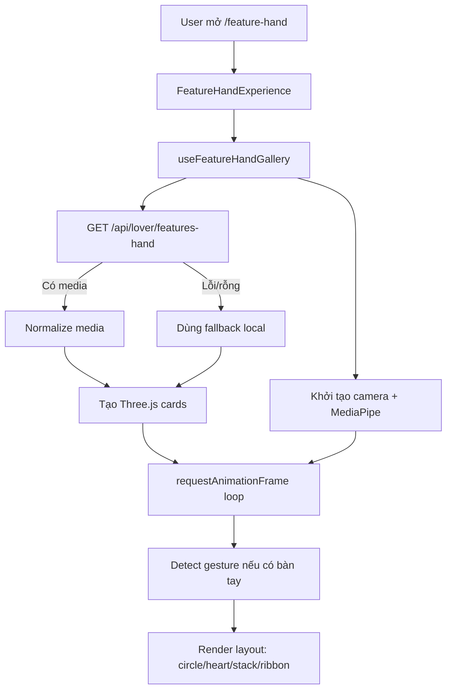

# Tài liệu kỹ thuật refactor FE, Feature Hand và Security

Tài liệu này giải thích lại toàn bộ phần refactor vừa làm cho FE theo cách dễ hiểu nhất có thể. Hãy xem nó như một buổi seminar kỹ thuật: ta đi từ bối cảnh, vấn đề ban đầu, kiến trúc mới, luồng chạy thật trong source code, rồi kết thúc bằng checklist để mở rộng về sau.

Mục tiêu không chỉ là “code chạy được”, mà là để dự án dễ đọc, dễ sửa, dễ thêm màn hình/API mới, và tránh tình trạng mỗi feature tự xử lý auth, ảnh, storage, date/time theo một kiểu riêng.

---

## 1. Bức tranh tổng quan

FE hiện tại dùng Next.js App Router. Dự án được tổ chức theo hướng:

```txt
src/
  app/                 Routing của Next.js: page, layout, route group
  features/            Logic theo từng nghiệp vụ: articles, chat, users, hand-gesture
  shared/              Thành phần dùng chung cấp ứng dụng: api, security, ui, navigation
  common/              Helper nền tảng, constants, config, type dùng chung
  providers/           React context provider cho state toàn app
public/
  feature-hand/        Ảnh fallback local cho màn hình Feature Hand
docs/
  discussion/          Tài liệu giải thích/refactor/trao đổi kỹ thuật
```

Ý tưởng chính:

- `src/app` chỉ nên là lớp routing/layout của Next.js.
- `src/features` chứa logic nghiệp vụ riêng từng màn hình/chức năng.
- `src/shared` chứa module dùng chung có liên quan trực tiếp tới UI/app runtime.
- `src/common` chứa helper thuần, constants, config, type nền tảng.
- Khi thấy logic lặp lại ở nhiều feature, ưu tiên đưa vào `common` hoặc `shared`.

Sau refactor, các phần quan trọng được chuẩn hóa:

- Feature Hand được tách khỏi một file lớn thành component, hook, API adapter, renderer, gesture lib, constants và types.
- Security route/API được gom về một nơi cấu hình.
- `httpClient` tự quyết định có gắn token hay không dựa trên security config.
- Các helper dùng chung như storage, image source, date/time, avatar image được đưa về common/shared.
- Các màn hình FE không còn tự xử lý ``, localStorage, auth option rải rác theo nhiều kiểu khác nhau.

---

## 2. Vì sao cần refactor

Trước khi refactor, code có vài dấu hiệu dễ gây khó bảo trì:

1. Một số file quá lớn, nhiều trách nhiệm nằm chung trong một component.

Ví dụ với Feature Hand, một file có thể vừa dựng UI, vừa gọi API, vừa mở camera, vừa xử lý MediaPipe, vừa render Three.js, vừa upload. Khi muốn sửa một phần nhỏ như layout trái tim, ta vẫn phải đọc cả khối logic camera/API/UI.

2. Security bị phân tán.

Nếu mỗi API tự truyền `auth: true` hoặc `auth: false`, người đọc phải mở từng file API mới biết endpoint nào cần token. Khi muốn tạm tắt bảo mật cho một endpoint, ta dễ sửa thiếu hoặc sửa nhầm.

3. Logic dùng chung bị lặp.

Ví dụ:

- Format ngày giờ trong chat tự viết riêng.
- Avatar có ảnh thì render ảnh, không có thì fallback chữ cái đầu.
- localStorage được gọi trực tiếp ở nhiều nơi.
- Markdown image source có thể không phải string nhưng mỗi nơi tự xử lý.

4. Khó onboard.

Một người mới vào dự án sẽ hỏi:

- Muốn thêm API mới thì thêm ở đâu?
- Muốn bật/tắt auth cho endpoint thì sửa chỗ nào?
- Muốn thêm layout Feature Hand thì đụng file nào?
- Vì sao API Feature Hand đang public?
- Nếu backend chưa trả ảnh thì FE hiển thị gì?

Tài liệu này trả lời các câu đó.

---

## 3. Nguyên tắc refactor đang áp dụng

### 3.1. Một file chỉ nên có một vai trò chính

Ví dụ Feature Hand sau refactor:

```txt
src/features/hand-gesture/
  components/
    feature-hand-experience.tsx     Component shell chính của màn hình
    feature-hand-controls.tsx       UI controls phía dưới
  hooks/
    use-feature-hand-gallery.ts     Orchestration: API, camera, MediaPipe, render loop
  lib/
    three-gallery.ts                Three.js scene, cards, layout, animation frame
    gesture-recognition.ts          Nhận diện gesture từ landmark bàn tay
    feature-hand-math.ts            Helper toán học nhỏ: clamp, distance, lerp
  contracts.ts                      Contract nội bộ cho media item
  feature-hand.constants.ts         Constants, fallback assets, layout options
  feature-hand.types.ts             TypeScript types cho layout/gesture
  hand-gesture-api.ts               Adapter gọi API /api/lover/features-hand
```

Khi đọc code, ta biết ngay:

- Muốn sửa giao diện nút: vào `feature-hand-controls.tsx`.
- Muốn sửa logic camera/render: vào `use-feature-hand-gallery.ts`.
- Muốn sửa vị trí ảnh trong không gian 3D: vào `three-gallery.ts`.
- Muốn sửa cách nhận diện bàn tay: vào `gesture-recognition.ts`.
- Muốn sửa endpoint/API shape: vào `hand-gesture-api.ts`.

### 3.2. Feature chỉ biết nghiệp vụ, không tự giải quyết hạ tầng

Feature nên gọi:

```ts
handGestureApi.listLoverMedia()
```

chứ không tự `fetch`, không tự gắn token, không tự đọc `NEXT_PUBLIC_API_BASE_URL`.

Việc gọi HTTP, gắn token, refresh token, parse lỗi API thuộc về `src/shared/api/http-client.ts`.

### 3.3. Security phải có source of truth

Thay vì rải `auth: true` ở nhiều API, ta khai báo rule tại:

```txt
src/shared/security/security.config.ts
```

Ví dụ:

```ts
{ endpoint: '/api/Article/**', authentication: authenticatedAccess }
```

Từ đó `httpClient` tự biết mọi API `/api/Article/...` cần token.

### 3.4. Logic dùng chung phải đưa về common/shared

Một số ví dụ đã được chuẩn hóa:

```txt
src/common/utils/browser-storage.ts
src/common/utils/format-date.ts
src/common/utils/image-source.ts
src/shared/ui/avatar-image.tsx
```

Quy tắc thực tế:

- Helper thuần, không phụ thuộc React UI: đưa vào `common/utils`.
- Component UI dùng chung: đưa vào `shared/ui`.
- API runtime dùng chung: đưa vào `shared/api`.
- Security toàn app: đưa vào `shared/security`.

---

## 4. Feature Hand từ A-Z

Feature Hand là màn hình gallery ảnh/video 3D, có thể:

- Lấy media từ API `/api/lover/features-hand`.
- Upload ảnh/video lên API đó.
- Nếu API lỗi hoặc không có media, dùng ảnh fallback local trong `public/feature-hand`.
- Render ảnh/video lớn ở trung tâm màn hình bằng Three.js.
- Dùng camera nhỏ ở góc dưới.
- Dùng MediaPipe Hands để đọc cử chỉ bàn tay.
- Chuyển layout gallery theo gesture hoặc theo nút bấm.

### 4.1. Luồng người dùng

Khi người dùng mở `/feature-hand`:

1. Next.js route render page `/feature-hand`.
2. Page gọi component `FeatureHandExperience`.
3. Component tạo hai ref:
   - `mountRef`: nơi Three.js gắn canvas.
   - `videoRef`: nơi camera preview hiển thị.
4. Hook `useFeatureHandGallery` được gọi để khởi tạo toàn bộ trải nghiệm.
5. Hook gọi API lấy media.
6. Nếu API trả media hợp lệ, render media đó.
7. Nếu API lỗi hoặc rỗng, dùng ảnh fallback local.
8. Hook khởi tạo camera và MediaPipe.
9. Mỗi animation frame:
   - Nếu có bàn tay, đọc landmark.
   - Tính gesture state.
   - Render lại vị trí, scale, opacity, rotation của từng card.
10. User có thể đổi layout bằng nút hoặc bằng gesture.
11. User có thể upload ảnh/video.
12. Sau upload thành công, hook tăng `mediaVersion` để reload gallery.

Luồng tổng quát:



### 4.2. Component shell: `feature-hand-experience.tsx`

File:

```txt
src/features/hand-gesture/components/feature-hand-experience.tsx
```

Vai trò:

- Là component client chính cho màn hình.
- Không chứa logic nặng.
- Chỉ tạo `mountRef`, `videoRef`.
- Gọi hook `useFeatureHandGallery`.
- Render:
  - Fullscreen section.
  - Host div cho Three.js canvas.
  - Video preview nhỏ.
  - Controls phía dưới.

Code quan trọng:

```ts
const mountRef = useRef<HTMLDivElement | null>(null);
const videoRef = useRef<HTMLVideoElement | null>(null);
const gallery = useFeatureHandGallery({ mountRef, videoRef });
```

Tư duy thiết kế:

- React giữ vai trò dựng khung UI.
- Three.js tự quản lý canvas bên trong `mountRef`.
- Camera preview dùng `videoRef`.
- State/UI control lấy từ object `gallery`.

Trong file có comment:

```ts
// tạm thời tắt bảo mật cho api này
```

Ý nghĩa:

- Hiện tại màn Feature Hand đang được mở public để test.
- Khi cần bật lại login/role, không sửa lung tung trong component.
- Ta bật lại tại security config, xem phần Security bên dưới.

### 4.3. Controls: `feature-hand-controls.tsx`

File:

```txt
src/features/hand-gesture/components/feature-hand-controls.tsx
```

Vai trò:

- Hiển thị hướng dẫn nhỏ dạng bubble phía dưới.
- Hiển thị trạng thái camera/API/upload.
- Hiển thị nút chọn layout.
- Hiển thị nút upload ảnh/video.

Các props chính:

```ts
cameraError
experienceReady
galleryError
isUploading
layout
mediaCount
onLayoutChange
onUpload
trackingState
uploadStatus
```

Tại sao tách controls riêng?

- UI controls thay đổi thường xuyên.
- Logic camera/API/render không nên nằm chung với markup nút.
- Khi muốn chỉnh chữ hướng dẫn, layout button, style dock phía dưới, chỉ cần sửa file này.

Các layout option được lấy từ:

```txt
src/features/hand-gesture/feature-hand.constants.ts
```

```ts
export const LAYOUT_OPTIONS: LayoutOption[] = [
    { label: 'Vong tron', value: 'circle' },
    { label: 'Trai tim', value: 'heart' },
    { label: 'Xep lop', value: 'stack' },
    { label: 'Dai anh', value: 'ribbon' },
];
```

Muốn thêm layout mới, không hardcode button trong component. Thêm vào `LAYOUT_OPTIONS`, sau đó xử lý layout trong `three-gallery.ts`.

### 4.4. Hook orchestration: `use-feature-hand-gallery.ts`

File:

```txt
src/features/hand-gesture/hooks/use-feature-hand-gallery.ts
```

Đây là “nhạc trưởng” của Feature Hand.

Nó không render UI trực tiếp. Nó điều phối:

- State UI.
- API media.
- Upload.
- Three.js scene.
- MediaPipe.
- Camera.
- Animation loop.
- Cleanup tài nguyên.

Các state chính:

```ts
cameraError
galleryError
experienceReady
layout
mediaVersion
mediaCount
uploadStatus
isUploading
trackingState
```

Ý nghĩa:

- `cameraError`: lỗi camera hoặc MediaPipe.
- `galleryError`: lỗi API hoặc lỗi khởi tạo gallery.
- `experienceReady`: đã setup xong scene/media/camera.
- `layout`: layout hiện tại.
- `mediaVersion`: tăng lên sau upload để reload media.
- `mediaCount`: số media thật từ API.
- `uploadStatus`: text trạng thái upload.
- `isUploading`: đang upload hay không.
- `trackingState`: text mô tả gesture/camera hiện tại.

#### Vì sao có `requestedLayoutRef`

Trong hook có:

```ts
const requestedLayoutRef = useRef<LayoutMode>('circle');
```

Lý do:

- Animation loop chạy bằng `requestAnimationFrame`.
- Nếu chỉ dùng React state `layout`, render loop có thể đọc state cũ hoặc phải phụ thuộc vào re-render.
- `useRef` cho phép loop đọc layout mới nhất mà không cần đăng ký lại effect.

Nói đơn giản:

- `layout` là state để UI biết layout hiện tại.
- `requestedLayoutRef` là state runtime nhanh cho render loop.

#### Upload hoạt động thế nào

Hàm:

```ts
handleUpload(event)
```

Luồng:

1. Lấy file từ `<input type="file">`.
2. Reset input value để chọn lại cùng file vẫn trigger change.
3. Set `isUploading = true`.
4. Gọi:

```ts
handGestureApi.uploadLoverMedia(file)
```

5. Nếu thành công:
   - Set status upload thành công.
   - Tăng `mediaVersion`.
6. `mediaVersion` là dependency của effect chính, nên effect sẽ cleanup và setup gallery lại.

#### Setup gallery hoạt động thế nào

Trong `useEffect`, hook:

1. Lấy DOM element từ `mountRef` và `videoRef`.
2. Tạo Three.js scene:

```ts
const { camera, galleryRoot, scene } = createGalleryScene();
const renderer = createGalleryRenderer(activeMountElement);
```

3. Tạo gesture state ban đầu:

```ts
const targetState = createInitialGestureState(requestedLayoutRef.current, FALLBACK_GALLERY_SIZE);
```

4. Load media từ API:

```ts
const mediaAssets = await handGestureApi.listLoverMedia().catch(...)
```

5. Nếu API lỗi hoặc không có data, dùng fallback:

```ts
const normalizedMedia = mediaAssets.length ? mediaAssets : FALLBACK_MEDIA_ASSETS;
```

6. Với từng media:
   - Có URL hợp lệ: tạo `createMediaCard`.
   - Lỗi texture: tạo `createFallbackCard`.

7. Khởi tạo camera + MediaPipe.

Điểm quan trọng:

```ts
// The gallery is useful even without camera, so media loads before optional hand tracking.
```

Nghĩa là:

- Camera fail không được làm màn hình trắng.
- API fail cũng không được làm màn hình trắng.
- Tối thiểu gallery fallback vẫn hiện để test UI/animation.

### 4.5. API adapter: `hand-gesture-api.ts`

File:

```txt
src/features/hand-gesture/hand-gesture-api.ts
```

Endpoint chính:

```ts
const LOVER_FEATURES_HAND_PATH = '/api/lover/features-hand';
```

API có hai hàm:

```ts
listLoverMedia()
uploadLoverMedia(file)
```

#### `listLoverMedia`

Gọi:

```ts
httpClient.get<unknown>(LOVER_FEATURES_HAND_PATH)
```

Sau đó adapter normalize response backend về contract ổn định:

```ts
export type LoverMediaItem = {
    id: string;
    type: 'image' | 'video';
    url: string;
    title: string;
    rawType: string;
};
```

Vì backend có thể trả shape khác nhau trong lúc phát triển, adapter chấp nhận nhiều field:

```ts
url, path, filePath, fileUrl, mediaUrl, src, attachmentUrl
```

Và nhiều collection wrapper:

```ts
items, files, media, results, attachments, data
```

Lợi ích:

- UI không cần biết backend đang trả `fileUrl` hay `mediaUrl`.
- Three.js renderer chỉ nhận `LoverMediaItem`.
- Khi backend đổi response shape, sửa adapter, không sửa renderer/UI.

#### `uploadLoverMedia`

Upload dùng `FormData`:

```ts
const formData = new FormData();
formData.append('file', file);
return httpClient.post<unknown>(LOVER_FEATURES_HAND_PATH, formData);
```

Vì body là `FormData`, `httpClient` sẽ không tự set `Content-Type: application/json`. Browser sẽ tự set multipart boundary.

### 4.6. Fallback media

File:

```txt
src/features/hand-gesture/feature-hand.constants.ts
public/feature-hand/fallback-01.svg
...
public/feature-hand/fallback-08.svg
```

Mục tiêu fallback:

- Backend chưa chạy vẫn test được UI.
- API lỗi vẫn thấy gallery.
- Camera lỗi vẫn thấy ảnh.
- Khi demo layout/animation không phụ thuộc backend.

Constant:

```ts
export const FALLBACK_MEDIA_ASSETS: LoverMediaItem[] = Array.from({ length: 8 }, ...)
```

Media fallback được map thành URL:

```txt
/feature-hand/fallback-01.svg
```

Vì nằm trong `public`, Next.js serve trực tiếp từ root path.

### 4.7. Gesture recognition

File:

```txt
src/features/hand-gesture/lib/gesture-recognition.ts
```

MediaPipe trả về danh sách landmark bàn tay. Mỗi landmark có tọa độ normalized.

Logic hiện tại dùng heuristic đơn giản:

- Đếm ngón tay đang duỗi.
- Tính khoảng cách thumb tip và index tip để nhận pinch.
- Tính độ spread của bàn tay để scale gallery.
- Tính vị trí bàn tay để xoay gallery.
- Nhận gesture:
  - Open palm: layout `circle`.
  - Peace sign/hai ngón: layout `heart`.
  - Fist/nắm tay: layout `stack`.
  - Pinch: zoom ảnh focus.

Code chính:

```ts
const isOpenPalm = extendedCount >= 4 && spread > 0.34;
const isFist = extendedCount <= 1 && spread < 0.28;
const isPeace = fingersExtended[0] && fingersExtended[1] && !fingersExtended[2] && !fingersExtended[3];
```

Sau đó trả về:

```ts
return {
    focusIndex,
    galleryScale,
    handDetected: true,
    layout,
    pinchActive,
    rotationY,
    tiltX,
};
```

Tại sao dùng heuristic đơn giản?

- Chạy mỗi frame nên cần nhanh.
- Dễ tune thông số.
- Không cần model custom.
- Đủ tốt cho trải nghiệm visual hiện tại.

Nếu sau này muốn gesture phức tạp hơn, chỉ cần nâng cấp file này.

### 4.8. Three.js renderer

File:

```txt
src/features/hand-gesture/lib/three-gallery.ts
```

File này chịu trách nhiệm:

- Tạo scene.
- Tạo camera.
- Tạo renderer.
- Load texture ảnh/video.
- Tạo card.
- Tính vị trí layout.
- Render frame.
- Dispose tài nguyên.

#### Tạo scene

```ts
createGalleryScene()
```

Tạo:

- `THREE.Scene`
- `THREE.PerspectiveCamera`
- `THREE.Group` tên `galleryRoot`
- Ambient light
- Rim light

`galleryRoot` là group chứa toàn bộ card. Khi muốn xoay/scale toàn gallery, ta chỉnh group thay vì chỉnh từng card.

#### Tạo renderer

```ts
createGalleryRenderer(container)
```

Tạo `THREE.WebGLRenderer`, set pixel ratio, append canvas vào DOM element.

#### Resize

```ts
resizeGalleryRenderer(container, renderer, camera)
```

Khi window resize:

- Set lại size renderer.
- Update camera aspect.
- Update projection matrix.

#### Load ảnh/video

Ảnh:

```ts
loadImageTexture(url)
```

Video:

```ts
loadVideoTexture(url)
```

Video được tạo bằng `<video>`, rồi chuyển thành `THREE.VideoTexture`.

#### Card là gì?

Type:

```ts
export type GalleryCard = {
    baseScale: THREE.Vector3;
    dispose: () => void;
    mesh: THREE.Mesh<THREE.PlaneGeometry, THREE.MeshBasicMaterial>;
};
```

Một card gồm:

- `mesh`: mặt phẳng hiển thị texture.
- `baseScale`: scale gốc theo tỉ lệ ảnh/video.
- `dispose`: cleanup geometry/material/texture/video.

#### Layout hoạt động thế nào

Function:

```ts
buildLayoutPosition(layout, index, count, focusIndex, time)
```

Với mỗi card, function tính:

- `opacity`
- `position`
- `rotation`
- `scale`

Ảnh focus luôn ở trung tâm:

```ts
if (index === normalizedFocus) {
    return {
        opacity: 1,
        position: new THREE.Vector3(0, 0.18, 1.4),
        scale: 1.58,
    };
}
```

Các ảnh phụ được xếp theo layout:

- `circle`: ảnh phụ đi theo vòng tròn quanh ảnh chính.
- `heart`: ảnh phụ đi theo công thức trái tim.
- `stack`: ảnh phụ xếp lớp phía trên.
- `ribbon`: ảnh phụ trải thành dải ngang phía dưới.

#### Animation mượt

Thay vì set vị trí ngay lập tức, code dùng `lerp`:

```ts
card.mesh.position.lerp(position, CARD_POSITION_SPEED);
card.mesh.scale.lerp(...);
card.mesh.material.opacity = lerp(...);
```

Lợi ích:

- Chuyển layout không giật.
- Gesture thay đổi liên tục nhưng card di chuyển mềm.
- Camera tracking nhiễu nhẹ vẫn không làm UI rung quá mạnh.

### 4.9. Cleanup tài nguyên

Trong hook return cleanup:

```ts
return () => {
    cancelled = true;
    window.removeEventListener('resize', updateSize);
    window.cancelAnimationFrame(frameId);
    stream?.getTracks().forEach((track) => track.stop());
    handLandmarker?.close();
    cards.forEach((card) => card.dispose());
    renderer.dispose();
    renderer.domElement.remove();
};
```

Đây là phần rất quan trọng với WebGL/camera.

Nếu không cleanup:

- Camera có thể vẫn chạy sau khi rời page.
- WebGL texture/material bị leak.
- Animation loop vẫn chạy ngầm.
- Quay lại page nhiều lần có thể lag hoặc crash.

### 4.10. Cách thêm layout mới cho Feature Hand

Ví dụ muốn thêm layout `spiral`:

1. Thêm type:

```ts
export type LayoutMode = 'circle' | 'heart' | 'stack' | 'ribbon' | 'spiral';
```

2. Thêm option:

```ts
{ label: 'Xoan oc', value: 'spiral' }
```

3. Thêm logic trong `buildLayoutPosition`:

```ts
if (layout === 'spiral') {
    // Tính x, y, z theo công thức spiral.
}
```

4. Nếu muốn gesture kích hoạt layout mới, sửa `gesture-recognition.ts`.

Không cần sửa:

- `FeatureHandExperience`
- `FeatureHandControls` nếu đã dùng `LAYOUT_OPTIONS`
- `httpClient`
- `security`

---

## 5. Security refactor từ A-Z

### 5.1. Vấn đề trước refactor

Nếu mỗi API call tự truyền:

```ts
httpClient.get('/api/Article/news', { auth: true })
```

thì security bị rải khắp source.

Hậu quả:

- Khó biết endpoint nào public/private.
- Tắt tạm auth một endpoint phải tìm nhiều file.
- Dễ quên role.
- Dễ mâu thuẫn route public nhưng API private hoặc ngược lại.

Sau refactor, security có source of truth:

```txt
src/shared/security/security.config.ts
```

### 5.2. Data model security

Type nằm ở:

```txt
src/shared/security/security.types.ts
```

Ý tưởng cấu hình giống yêu cầu:

```ts
{
    endpoint: '/news',
    authentication: {
        auth: true,
        roles: ['Role_Lover', 'Role_Member'],
        redirectTo: '/login',
    },
}
```

Ý nghĩa:

- `endpoint`: route hoặc API path.
- `auth`: endpoint có cần đăng nhập không.
- `roles`: nếu có, user phải có một trong các role này.
- `guestOnly`: chỉ dành cho user chưa login, ví dụ `/login`, `/register`.
- `redirectTo`: nếu không được phép thì redirect đi đâu.

### 5.3. Route security rules

File:

```txt
src/shared/security/security.config.ts
```

Route rules:

```ts
export const ROUTE_SECURITY_RULES: SecurityRule[] = [
    { endpoint: APP_ROUTES.home, authentication: publicAccess },
    { endpoint: APP_ROUTES.login, authentication: { auth: false, guestOnly: true, redirectTo: APP_ROUTES.dashboard } },
    { endpoint: APP_ROUTES.dashboard, authentication: authenticatedAccess },
    { endpoint: APP_ROUTES.news, authentication: authenticatedAccess },
    ...
];
```

Các route cần login dùng:

```ts
const authenticatedAccess = { auth: true, redirectTo: APP_ROUTES.login } as const;
```

Route public dùng:

```ts
const publicAccess = { auth: false } as const;
```

### 5.4. API security rules

API rules:

```ts
export const API_SECURITY_RULES: SecurityRule[] = [
    { endpoint: '/api/Auth/login', authentication: publicAccess },
    { endpoint: '/api/User/create', authentication: publicAccess },
    { endpoint: '/api/Auth/logout', authentication: authenticatedAccess },
    { endpoint: '/api/User/**', authentication: authenticatedAccess },
    { endpoint: '/api/Article/**', authentication: authenticatedAccess },
    { endpoint: '/api/Chat/**', authentication: authenticatedAccess },
];
```

Wildcard:

- `/api/User/**` nghĩa là mọi API bên dưới `/api/User/...`.
- Rule cụ thể nên đặt trước rule rộng.

Vì resolver dùng cơ chế:

```ts
// First match wins so config order can express exceptions before wildcards.
```

Ví dụ:

```ts
{ endpoint: '/api/User/create', authentication: publicAccess },
{ endpoint: '/api/User/**', authentication: authenticatedAccess },
```

Nếu đảo thứ tự, `/api/User/create` có thể bị match bởi `/api/User/**` trước và bị xem là private.

### 5.5. Feature Hand đang tắt bảo mật ở đâu

Hiện tại Feature Hand được tắt bảo mật tạm ở 2 nơi trong config:

```ts
// tạm thời tắt bảo mật cho api này
{ endpoint: APP_ROUTES.featureHand, authentication: publicAccess },
```

và:

```ts
// tạm thời tắt bảo mật cho api này
{ endpoint: '/api/lover/features-hand', authentication: publicAccess },
```

Ý nghĩa:

- Route `/feature-hand` không yêu cầu login.
- API `/api/lover/features-hand` không gắn bearer token từ FE.

Khi muốn bật lại login:

```ts
{ endpoint: APP_ROUTES.featureHand, authentication: authenticatedAccess },
{ endpoint: '/api/lover/features-hand', authentication: authenticatedAccess },
```

Khi muốn yêu cầu role lover:

```ts
{
    endpoint: APP_ROUTES.featureHand,
    authentication: {
        auth: true,
        roles: [APP_ROLES.lover],
        redirectTo: APP_ROUTES.login,
    },
},
{
    endpoint: '/api/lover/features-hand',
    authentication: {
        auth: true,
        roles: [APP_ROLES.lover],
    },
},
```

Lưu ý quan trọng:

- FE security giúp UI/route/API call nhất quán.
- Backend vẫn phải là nơi quyết định authorization cuối cùng.
- Không nên xem role check ở FE là bảo mật tuyệt đối.

### 5.6. Security resolver

File:

```txt
src/shared/security/security-resolver.ts
```

Resolver làm 3 việc:

1. Normalize endpoint.
2. Match endpoint với rule.
3. Quyết định user có được vào route hay không.

#### Normalize endpoint

Ví dụ:

```txt
/api/Article/news?page=1
```

được normalize thành:

```txt
/api/Article/news
```

Lợi ích:

- Query string không làm sai rule.
- Có thể match ổn định.

#### Dynamic segment

Rule:

```txt
/articles/:id
```

match:

```txt
/articles/123
```

Resolver cũng hỗ trợ kiểu Next:

```txt
/articles/[id]
```

#### Wildcard

Rule:

```txt
/api/Chat/**
```

match mọi API bên dưới `/api/Chat`.

#### Decide access

Function:

```ts
decideRouteAccess(policy, isAuthenticated, roles)
```

Luồng:

1. Nếu `guestOnly` và user đã login: redirect dashboard.
2. Nếu `auth = true` mà user chưa login: redirect login.
3. Nếu cần role mà user không có role: redirect dashboard.
4. Nếu qua hết: allowed.

### 5.7. Route guard

File:

```txt
src/shared/security/route-security-guard.tsx
```

Root layout bọc children bằng:

```tsx
<RouteSecurityGuard>{children}</RouteSecurityGuard>
```

Route guard lấy:

```ts
const pathname = usePathname();
const { isAuthenticated, isHydrated, roles } = useAuth();
```

Sau đó:

```ts
const policy = resolveRouteAuthentication(pathname);
const decision = decideRouteAccess(policy, isAuthenticated, roles);
```

Nếu chưa hydrate:

```ts
return null;
```

Vì sao phải chờ hydrate?

- Auth token/role thường nằm ở localStorage hoặc client state.
- Server render ban đầu chưa chắc biết user đã login.
- Nếu render protected content trước khi hydrate, có thể chớp nội dung nhạy cảm.

### 5.8. API auth trong httpClient

File:

```txt
src/shared/api/http-client.ts
```

Khi feature gọi:

```ts
httpClient.get('/api/Article/news')
```

`httpClient` tự làm:

```ts
const apiPolicy = resolveApiAuthentication(path);
const shouldAttachAuth = auth ?? apiPolicy.auth;
```

Ý nghĩa:

- Nếu call không truyền `auth`, dùng config chung.
- Nếu call có truyền `auth`, đó là override có chủ đích.

Sau đó nếu cần auth:

```ts
const token = tokenStorage.get();
nextHeaders.set('Authorization', `Bearer ${token}`);
```

Khi response 401:

```ts
const nextToken = await refreshAccessToken(accessToken);
```

Nếu refresh được token:

```ts
return request<T>(path, {
    ...options,
    retryOnUnauthorized: false,
});
```

Điểm tốt:

- Feature API không cần biết refresh token.
- Không lặp logic bearer token.
- Không lặp parse error.
- Không lặp global loading.

### 5.9. Thêm endpoint mới nên làm thế nào

Ví dụ thêm endpoint `/api/News/latest`.

Nếu public:

```ts
{ endpoint: '/api/News/latest', authentication: publicAccess }
```

Nếu mọi `/api/News/**` đều cần login:

```ts
{ endpoint: '/api/News/**', authentication: authenticatedAccess }
```

Sau đó trong feature API:

```ts
export const newsApi = {
    latest() {
        return httpClient.get<LatestNewsResponse>('/api/News/latest');
    },
};
```

Không cần:

```ts
{ auth: true }
```

trừ khi thật sự muốn override khác rule chung.

---

## 6. Refactor toàn bộ FE: common/shared layer

Phần này giải thích các helper/component dùng chung sau refactor.

### 6.1. `browser-storage.ts`

File:

```txt
src/common/utils/browser-storage.ts
```

Vấn đề:

- `localStorage` chỉ tồn tại trên browser.
- Next.js có server render.
- Gọi `localStorage` trực tiếp dễ lỗi nếu chạy ở server.
- Browser private mode hoặc strict policy có thể throw khi đọc/ghi storage.

Helper mới:

```ts
browserStorage.get(key)
browserStorage.set(key, value)
browserStorage.remove(key)
browserStorage.getJson<T>(key, fallback)
browserStorage.setJson(key, value)
```

Được dùng bởi:

- `token-storage.ts`
- `public-id-storage.ts`
- `theme-provider.tsx`
- `notification-center.utils.ts`

Ý nghĩa:

- Một nơi duy nhất guard SSR.
- Một nơi duy nhất bắt lỗi storage.
- Các module khác không gọi `window.localStorage` trực tiếp.

Ngoại lệ:

- `src/app/layout.tsx` có inline script đọc localStorage theme trước hydration.
- Đây là trường hợp hợp lý vì cần set class `dark` thật sớm để tránh flash theme.

### 6.2. `format-date.ts`

File:

```txt
src/common/utils/format-date.ts
```

Các function hiện có:

```ts
formatDateTime(value)
formatChatMessageTime(value)
formatChatListTime(value)
getDateTimestamp(value)
```

Mục tiêu:

- Không để mỗi component tự `new Date`.
- Không lặp `Intl.DateTimeFormat`.
- Invalid date trả fallback ổn định.
- Sort message/inbox dùng cùng logic timestamp.

Ví dụ:

- Article/profile dùng `formatDateTime`.
- Bubble chat dùng `formatChatMessageTime`.
- Inbox list dùng `formatChatListTime`.
- Chat provider sort message bằng `getDateTimestamp`.

### 6.3. `image-source.ts`

File:

```txt
src/common/utils/image-source.ts
```

Function:

```ts
toRenderableImageSrc(value)
```

Lý do:

- Một số source ảnh từ markdown/API có type rộng.
- `next/image` chỉ nhận string hoặc static import.
- Nếu truyền nhầm `Blob` hoặc object, TypeScript/build có thể lỗi.

Helper này normalize:

```ts
return typeof value === 'string' ? value.trim() : '';
```

Được dùng bởi:

- `AvatarImage`
- Markdown image renderer trong `article-composer.tsx`

### 6.4. `AvatarImage`

File:

```txt
src/shared/ui/avatar-image.tsx
```

Vấn đề trước:

Mỗi màn hình tự viết:

```tsx
{avatar ?  : <span>AB</span>}
```

Hậu quả:

- Lặp code.
- `` gây lint warning trong Next.js.
- Fallback mỗi nơi khác nhau.
- Remote avatar có thể từ nhiều host khác nhau.

Component mới:

```tsx
<AvatarImage
    src={user.avatar}
    alt={user.displayName}
    fallback={user.displayName.charAt(0).toUpperCase()}
    sizes="44px"
/>
```

Component dùng `next/image` với `unoptimized`.

Vì sao `unoptimized`?

- Avatar có thể đến từ backend, user upload, hoặc nhiều host khác nhau.
- Nếu dùng optimization mặc định, Next.js cần cấu hình remote pattern đủ hết host.
- Với avatar nhỏ, ưu tiên độ ổn định và tránh vỡ màn hình trong dev.

Đã thay ở:

- News composer avatar author.
- Inbox popover candidate avatar.
- Profile panel avatar.

### 6.5. `next.config.ts` image config

File:

```txt
next.config.ts
```

Đã thêm:

- Host ảnh fallback article: `images.unsplash.com`
- Host backend theo `NEXT_PUBLIC_API_BASE_URL` hoặc fallback `http://localhost:5019`

Lý do:

- `next/image` với remote URL cần config remotePatterns.
- Config rõ host an toàn hơn mở rộng tùy tiện.

### 6.6. API feature pattern

Các feature API sau refactor nên theo pattern:

```ts
export const articlesApi = {
    create(payload) {
        return httpClient.post('/api/Article/create', objectToFormData(payload));
    },
};
```

Feature API không nên tự:

- Gắn token.
- Refresh token.
- Parse response.
- Đọc base URL.
- Tự quyết định auth nếu config đã có rule.

Các việc đó thuộc về:

```txt
src/shared/api/http-client.ts
src/shared/security/security.config.ts
```

---

## 7. Luồng request FE sau refactor

Ví dụ user mở `/news`.

```mermaid
flowchart TD
    A[User vào /news] --> B[RouteSecurityGuard]
    B --> C[resolveRouteAuthentication('/news')]
    C --> D{Cần auth?}
    D -->|Chưa login| E[Redirect /login]
    D -->|Đã login| F[Render News page]
    F --> G[articlesApi.getNews]
    G --> H[httpClient.get('/api/Article/news')]
    H --> I[resolveApiAuthentication('/api/Article/news')]
    I --> J[Gắn Bearer token]
    J --> K[fetch backend]
    K --> L{401?}
    L -->|Có| M[Refresh access token và retry 1 lần]
    L -->|Không| N[parseResponse]
```

Ví dụ user mở `/feature-hand` hiện tại:

```mermaid
flowchart TD
    A[User vào /feature-hand] --> B[RouteSecurityGuard]
    B --> C[Rule publicAccess]
    C --> D[Render FeatureHandExperience]
    D --> E[handGestureApi.listLoverMedia]
    E --> F[httpClient.get('/api/lover/features-hand')]
    F --> G[Rule publicAccess nên không gắn token]
    G --> H{API OK?}
    H -->|Có| I[Render media API]
    H -->|Không/rỗng| J[Render fallback local]
```

---

## 8. Cách đọc source sau refactor

Nếu bạn muốn hiểu một flow, đọc theo thứ tự này.

### 8.1. Với một màn hình Next.js

1. Vào `src/app/.../page.tsx`.
2. Xem page render component feature nào.
3. Vào `src/features/.../components`.
4. Nếu component gọi hook, đọc `src/features/.../hooks`.
5. Nếu hook gọi API, đọc `src/features/.../*-api.ts`.
6. Nếu có logic dùng chung, đọc `src/shared` hoặc `src/common`.

### 8.2. Với một API call

1. Feature API gọi `httpClient`.
2. `httpClient` hỏi `resolveApiAuthentication`.
3. Resolver đọc `API_SECURITY_RULES`.
4. Nếu cần auth, lấy token từ `tokenStorage`.
5. Fetch backend.
6. Parse response hoặc throw `ApiError`.

### 8.3. Với một route protected

1. Root layout bọc `RouteSecurityGuard`.
2. Guard lấy pathname.
3. Guard hỏi `resolveRouteAuthentication`.
4. Guard hỏi auth provider user đã login chưa.
5. Guard redirect hoặc render children.

---

## 9. Quy tắc đặt code vào common/shared/features

### 9.1. Đặt vào `features`

Khi code chỉ phục vụ một nghiệp vụ.

Ví dụ:

- Gesture recognition của Feature Hand.
- API adapter `/api/lover/features-hand`.
- Article composer slash commands.

### 9.2. Đặt vào `shared`

Khi code dùng chung trong app và có tính ứng dụng/UI/runtime.

Ví dụ:

- `httpClient`
- `RouteSecurityGuard`
- `AvatarImage`
- Navigation notification center
- Global loading store

### 9.3. Đặt vào `common`

Khi code là helper thuần hoặc config nền.

Ví dụ:

- `format-date`
- `browser-storage`
- `image-source`
- `app-routes`
- `env`

### 9.4. Không nên đưa vào common quá sớm

Không phải cứ thấy hai dòng giống nhau là đưa vào common. Chỉ đưa lên khi:

- Logic thật sự có cùng ý nghĩa.
- Có khả năng dùng lại ở nhiều nơi.
- Việc dùng chung làm code rõ hơn.
- Không làm common phụ thuộc ngược vào feature cụ thể.

---

## 10. Comment code kiểu senior nên như thế nào

Comment tốt không mô tả điều hiển nhiên.

Không cần comment:

```ts
// Set loading to true
setIsLoading(true);
```

Nên comment khi:

- Có quyết định kiến trúc.
- Có trade-off.
- Có workaround.
- Có logic dễ bị sửa nhầm.
- Có lý do không hiển nhiên.

Ví dụ tốt:

```ts
// Keep the latest requested layout outside React state so the render loop can read it without re-subscribing.
const requestedLayoutRef = useRef<LayoutMode>('circle');
```

Comment này giải thích vì sao dùng ref thay vì state.

Ví dụ tốt khác:

```ts
// API data wins; local assets are only a stable test path for offline backend/dev camera checks.
```

Comment này giải thích fallback không phải data thật.

---

## 11. Những điểm cần nhớ khi mở rộng Feature Hand

### 11.1. Backend response thay đổi

Sửa:

```txt
src/features/hand-gesture/hand-gesture-api.ts
```

Không sửa:

```txt
three-gallery.ts
feature-hand-experience.tsx
feature-hand-controls.tsx
```

### 11.2. Thêm layout mới

Sửa:

```txt
feature-hand.types.ts
feature-hand.constants.ts
three-gallery.ts
```

Nếu cần gesture mới:

```txt
gesture-recognition.ts
```

### 11.3. Camera bị lỗi

Kiểm tra:

- Browser permission camera.
- HTTPS/local dev permission.
- MediaPipe CDN/model URL.
- Console error từ `startHandTracking`.

Nhưng gallery vẫn phải render fallback/media bình thường.

### 11.4. API bị lỗi

Kiểm tra:

- Backend có endpoint `/api/lover/features-hand`.
- Response có field URL hợp lệ.
- API security rule hiện public hay private.
- Nếu private, user đã login chưa.
- Nếu URL media là relative path, `resolveAssetUrl` sẽ ghép với `appConfig.apiBaseUrl`.

### 11.5. Upload không hoạt động

Kiểm tra:

- Backend nhận field form-data tên `file` chưa.
- Endpoint POST có đúng `/api/lover/features-hand` không.
- Nếu bật auth, FE đã gắn token chưa.
- Network tab response lỗi gì.

---

## 12. Những điểm cần nhớ khi mở rộng Security

### 12.1. Muốn route cần login

Thêm vào `ROUTE_SECURITY_RULES`:

```ts
{ endpoint: '/my-page', authentication: authenticatedAccess }
```

### 12.2. Muốn route public

```ts
{ endpoint: '/landing', authentication: publicAccess }
```

### 12.3. Muốn route chỉ cho guest

```ts
{
    endpoint: '/login',
    authentication: {
        auth: false,
        guestOnly: true,
        redirectTo: APP_ROUTES.dashboard,
    },
}
```

### 12.4. Muốn API cần token

```ts
{ endpoint: '/api/MyFeature/**', authentication: authenticatedAccess }
```

### 12.5. Muốn API public nhưng nằm trong wildcard private

Đặt rule public trước wildcard:

```ts
{ endpoint: '/api/User/create', authentication: publicAccess },
{ endpoint: '/api/User/**', authentication: authenticatedAccess },
```

### 12.6. Muốn yêu cầu role

```ts
{
    endpoint: '/admin',
    authentication: {
        auth: true,
        roles: [APP_ROLES.admin],
        redirectTo: APP_ROUTES.login,
    },
}
```

### 12.7. Vai trò FE và backend

FE:

- Ẩn/hiện UI.
- Redirect route.
- Quyết định có gắn token khi gọi API.
- Giúp UX và code rõ hơn.

Backend:

- Phải kiểm tra token.
- Phải kiểm tra role.
- Phải từ chối request trái phép.

Không bao giờ chỉ dựa vào FE để bảo mật dữ liệu.

---

## 13. Validation sau refactor

Các lệnh đã chạy:

```bash
npm run lint
npx tsc --noEmit --pretty false
npm run build
```

Kết quả:

- ESLint pass.
- TypeScript pass.
- Production build pass.

Lưu ý:

- `npm run build` cần network để tải Google Fonts từ `next/font/google`.
- Trong sandbox restricted network, build có thể fail vì không tải được font.
- Khi chạy ngoài sandbox có network, build đã pass.

---

## 14. Tóm tắt kiến trúc sau refactor

### Feature Hand

```txt
UI shell -> hook orchestration -> API adapter / Three renderer / Gesture lib
```

Tách rõ:

- UI
- State orchestration
- API
- Camera/MediaPipe
- Three.js rendering
- Math/gesture helper
- Constants/types

### Security

```txt
security.config -> security-resolver -> RouteSecurityGuard/httpClient
```

Tách rõ:

- Khai báo rule.
- Match rule.
- Quyết định route access.
- Quyết định API attach token.

### Common/shared

```txt
common/utils      Helper thuần
shared/ui         Component UI dùng chung
shared/api        HTTP/storage/realtime runtime
shared/security   Auth/role routing rules
```

Tách rõ:

- Logic dùng chung không nằm lẫn trong feature.
- Feature code chỉ tập trung nghiệp vụ.
- Nền tảng app nằm một nơi dễ tìm.

---

## 15. Checklist khi thêm feature mới

Khi thêm một feature FE mới, đi theo checklist này:

1. Tạo folder trong `src/features/<feature-name>`.
2. Tạo component màn hình trong `components`.
3. Nếu có logic state phức tạp, tạo hook trong `hooks`.
4. Nếu có API, tạo `<feature-name>-api.ts`.
5. Nếu có contract backend, tạo `contracts.ts`.
6. Nếu có constants/type riêng, tách thành `*.constants.ts` và `*.types.ts`.
7. Nếu route cần auth, thêm vào `ROUTE_SECURITY_RULES`.
8. Nếu API cần auth, thêm vào `API_SECURITY_RULES`.
9. Không truyền `auth: true` ở API call nếu security config đã có rule.
10. Nếu thấy logic dùng lại ở nhiều feature, cân nhắc đưa vào `common` hoặc `shared`.
11. Thêm comment ngắn ở phần logic có quyết định kỹ thuật.
12. Chạy:

```bash
npm run lint
npx tsc --noEmit --pretty false
npm run build
```

---

## 16. Checklist khi review code FE

Khi review một PR hoặc một feature mới, hỏi:

- File component có đang làm quá nhiều việc không?
- API call có đi qua `httpClient` không?
- Auth rule đã nằm trong `security.config.ts` chưa?
- Có gọi `localStorage` trực tiếp ngoài helper không?
- Có format date/time riêng trong component không?
- Có dùng `` trực tiếp không, hay đã có component/shared phù hợp?
- Có fallback khi API lỗi không?
- Có cleanup effect/camera/socket/WebGL không?
- Có comment giải thích các quyết định khó hiểu không?
- Build/lint/type có pass không?

---

## 17. Kết luận

Refactor này đưa FE về hướng dễ phát triển lâu dài hơn:

- Feature Hand không còn là một file lớn khó đọc.
- Security route/API có một nơi cấu hình tập trung.
- HTTP client tự xử lý auth, token refresh, loading và error parsing.
- Common/shared helper giảm lặp code.
- UI avatar/date/storage/image source có chuẩn dùng chung.
- Fallback media giúp Feature Hand test được ngay cả khi API/camera lỗi.
- Code có comment ngắn ở những điểm dễ bị hiểu nhầm.

Điều quan trọng nhất: từ giờ khi thêm màn hình hoặc API mới, ta không nên copy logic cũ rồi sửa tại chỗ. Hãy hỏi trước:

- Đây là logic riêng của feature hay dùng chung?
- Auth nên khai báo ở security config chưa?
- API đã đi qua adapter và `httpClient` chưa?
- Có fallback/cleanup/typing rõ ràng chưa?

Nếu giữ các nguyên tắc này, source FE sẽ càng lớn càng dễ quản lý, thay vì càng lớn càng rối.
